  # Documentation: Creating a VirtualBox VM with bonus ​👩🏻‍💻​​

## ⭐​ Table of content ⭐​

1. [Introduction](#introduction)

   ​[Part 1️⃣: Setting Up a Virtual Machine](#part-1️⃣-setting-up-a-virtual-machine)

3. [Requirements](#Requirements)
    - [Step 1: Download and Install VirtualBox](#step-1-download-and-install-virtualbox)
    - [Step 2: Download the Debian or Rocky ISO](#step-2-Download-the-Debian-or-Rocky-ISO)
    - [Step 3: Create a New Virtual Machine](#Step-3-Create-a-New-Virtual-Machine)
    - [Step 4: Configure Your VM](#Step-4-Configure-Your-VM)
    - [Step 5: Install Debian or Rocky on Your VM](#Step-5-Install-Debian-or-Rocky-on-Your-VM)
4. [Installation Process](#installation-process)
    -  [Getting Started](#getting-started)
        -  [1. Start Installation](#1-start-installation)
        -  [2.Choose Preferred Language](#2-choose-preferred-language)
    - [Language and Location Configuration](#language-and-location-configuration)
        -  [3. Choose Location](#3-choose-location)
        -  [4. Choose Continent or Region](#4-choose-continent-or-region)
        -  [5. Choose Country](#5-choose-country)
    - [User Configuration](#user-configuration)
        -  [6. Configure Keyboard](#6-configure-keyboard)
        -  [7. Choose Hostname](#7-choose-hostname)
    - [Security Settings](#security-settings)
        -  [8. Skip Domain Name](#8-skip-domain-name)
        -  [9. Set Up Root Password](#9-set-up-root-password)
        -  [10. Re-enter Your Password](#10-re-enter-your-password)
        -  [11. Write Fullname for the New User](#write-fullname-for-the-new-user)
        -  [12.Account Username](#12-account-username)
        -  [13. Choose Password for New User](#13-choose-password-for-new-user)
        -  [14.Re-enter New User Password](#14-re-enter-new-user-password)
        -  [15.Select Time Zone Location](#15-select-time-zone-location)
    - [Partitioning and Storage](#partitioning-and-storage)
        -  [16. Select Partitioning Method](#16-select-partitioning-method)
        -  [17. Manual Partitioning - Select Partition](#17-manual-partitioning---select-partition)
        -  [18. Manual Partitioning - Create New Table](#18-manual-partitioning---create-new-table)
        -  [19. Manual Partitioning - Choose Free Space](#19-manual-partitioning---choose-free-space)
        -  [20. Manual Partitioning - Use Free Space](#20-manual-partitioning---use-free-space)
        -  [21. Manual Partitioning - New Partition Size](#21-manual-partitioning---new-partition-size)
        -  [22. Manual Partitioning - Partition Type](#22-manual-partitioning---partition-type)
        -  [23. Manual Partitioning - Partition Location](#23-manual-partitioning---partition-location)
        -  [24. Manual Partitioning - Partition Settings](#24-manual-partitioning---partition-settings)
        -  [25. Manual Partitioning - Second Disk](#25-manual-partitioning---second-disk)
        -  [26. Manual Partitioning - Use Second Disk Space](#26-manual-partitioning---use-second-disk-space)
        -  [27. Manual Partitioning - Second Disk Size](#27-manual-partitioning---second-disk-size)
        -  [28. Manual Partitioning - Second Disk Type](#28-manual-partitioning---second-disk-type)
        -  [29. Setting Logical Partition](#29-setting-logical-partition)
        -  [30. Primary and Logical Setup Complete](#30-primary-and-logical-setup-complete)
    - [LVM Configuration](#lvm-configuration)
        -  [31. Configure LVM](#31-configure-lvm)
        -  [32. LVM - Write Changes](#32-lvm---write-changes)
        -  [33. LVM Configuration Details](#33-lvm-configuration-details)
        -  [34. Volume Group Name](#34-volume-group-name)
        -  [35. Choose Devices for Volume Group](#35-choose-devices-for-volume-group)
        -  [36. LVM - Finalize Changes](#36-lvm---finalize-changes)
        -  [37. Volume Configuration](#37-volume-configuration)
        -  [38. Create Volume Group](#38-create-volume-group)
        -  [39. Create Logical Volume](#39-create-logical-volume)
        -  [40. Name Logical Volume](#40-name-logical-volume)
        -  [41. Set Logical Volume Size](#41-set-logical-volume-size)
        -  [42. Complete Logical Volume Configuration](#42-complete-logical-volume-configuration)
        -  [43. LVM Group Overview](#43-lvm-group-overview)
        -  [44. Partition Configuration Overview](#44-partition-configuration-overview)
        -  [45. Partition Settings Overview](#45-partition-settings-overview)
        -  [46. Format the partition case](#46-format-the-partition-case)
    - [Encryption Configuration](#encryption-configuration)
        -  [47. Configure Encrypted Volumes](#47-configure-encrypted-volumes)
        -  [48. Encryption - Write Changes](#48-encryption---write-changes)
        -  [49. Encryption Configuration Actions](#49-encryption-configuration-actions)
        -  [50. Select Devices to Encrypt](#50-select-devices-to-encrypt)
        -  [51. Confirm Data Erasure for Encryption](#51-confirm-data-erasure-for-encryption)
        -  [52. Erasing Data for Encryption](#52-erasing-data-for-encryption)
        -  [53. Enter Encryption Passphrase](#53-enter-encryption-passphrase)
        -  [54. Review Encrypted Partition Overview](#54-review-encrypted-partition-overview)
        -  [55. Complete Overview of Encrypted Partition](#55-complete-overview-of-encrypted-partition)
5. [Post Installation Steps](#post-installation-steps)
   - [Error Handling and Troubleshooting](#error-handling-and-troubleshooting)
        -  [57. In Case of Errors](#57-in-case-of-errors)
    - [Repository and Network Configuration](#repository-and-network-configuration)
        -  [58. Reconfigure LVM](#58-reconfigure-lvm)
        -  [59. Review Encrypted Partition](#59-review-encrypted-partition)
        -  [60. Write Changes to Disk](#60-write-changes-to-disk)
        -  [61. Troubleshoot Encryption Errors](#61-troubleshoot-encryption-errors)
    - [Software Selection](#software-selection)
        -  [62. Scan Additional Installation Media](#62-scan-additional-installation-media)
        -  [63. Select Mirror Country](#63-select-mirror-country)
        -  [64. Select Debian Archive Mirror](#64-select-debian-archive-mirror)
        -  [65. Enter HTTP Proxy Information](#65-enter-http-proxy-information)
        -  [66. Software Installation Process](#66-software-installation-process)
        -  [67. Choose Software to Install](#67-choose-software-to-install)
    - [Configuration boot grub](#Configuration-boot-grub)
        -  [68. GRUB Boot Loader](#68-grub-boot-loader)
        -  [69. Device for Boot Loader Installation](#69-device-for-boot-loader-installation)
    - [Finishing installation](#Finishing-installation)
        -  [70. Finish Installation](#70-finish-installation)
        -  [71. Installation Complete](#71-installation-complete)
      
   [Part 2️⃣: Operating System Configuration](#part-2️⃣-operating-system-configuration)
    - [Initial Setup and Access](#Initial-Setup-and-Access)
        -  [72 Starting VirtualBox](#71-starting-virtualbox)
        -  [73. Verifying User Credentials for System Access](#73-verifying-user-credentials-for-system-access)
        -  [74. Understanding and Using User Prompts](#74-understanding-and-using-user-prompts)
        -  [75. Using su to Switch Users](#75-using-su-to-switch-users)
        -  [76. Understanding and Using Root User Prompts](#76-understanding-and-using-root-user-prompts)
    - [Package Management and sudo Installation](#Package-Management-and-sudo-Installation)
        -  [77. Installing apt (Advance Package Tool)](#77-installing-apt-advance-package-tool)
        -  [78. Installing sudo on a Linux system](#78-installing-sudo-on-a-linux-system)
        -  [79. Sudo reboot command](#79-sudo-reboot-command)
        -  [80. APT Check Verification](#80-apt-check-verification)
        -  [81. Verifying sudo Installation and Configuration](#81-verifying-sudo-installation-and-configuration)
     - [User Management](#User-Management)
        -  [82. Creating a User with Your Login Name](#82-creating-a-user-with-your-login-name)
        -  [83. Adding a User to a Group](#83-adding-a-user-to-a-group)
        -  [84. Verifying User Group Creation](#84-verifying-user-group-creation)
        -  [85. Verifying User Group Memberships for Corresponding Usernames](#85-verifying-user-group-memberships-for-corresponding-usernames)
     - [SSH Configuration](#SSH-Configuration)
        -  [86. Executing sudo apt update During SSH Terminal Configuration](#86-executing-sudo-apt-update-during-ssh-terminal-configuration)
        -  [87. Installing OpenSSH Server](#87-installing-openssh-server)
        -  [88. Verifying SSH Terminal Installation and Configuration](#88-verifying-ssh-terminal-installation-and-configuration)
        -  [89. Configuring SSH Terminal Service](#89-configuring-ssh-terminal-service)
        -  [90. Editing SSH Server Configuration](#90-editing-ssh-server-configuration)
        -  [91. Restarting SSH Service and Verification](#91-restarting-ssh-service-and-verification)
     - [Firewall Setup](#Firewall-Setup)
        -  [92. Setting Up UFW (Uncomplicated Firewall)](#92-setting-up-ufw-uncomplicated-firewall)
        -  [93. Enabling UFW Firewall Protection](#93-enabling-ufw-firewall-protection)
        -  [94. Allowing Connections on Port](#94-allowing-connections-on-port)
        -  [95. Verifying UFW Status](#95-verifying-ufw-status)
     - [Configuring Sudo Settings](#Configuring-Sudo-Settings)
        -  [96. Strengthening System Security: Creating a Strong Password](#96-Strengthening-System-Security-Creating-a-Strong-Password)
        -  [97. Creating sudo Directory for Command Logs](#97-creating-sudo-directory-for-command-logs)
        -  [98. Editing the sudo Configuration File](#98-editing-the-sudo-configuration-file)
        -  [99. Verification of Sudo Configuration Changes](#99-verification-of-sudo-configuration-changes)
     - [Strong Password Policy Configuration](#Strong-Password-Policy-Configuration)
        -  [100. Editing the login.defs File](#100-editing-the-logindefs-file)
        -  [101. Configuring Strong Password Policy in login.defs File](#101-configuring-strong-password-policy-in-logindefs-file)
        -  [102. Installing Required Packages for Password Policy Configuration](#102-installing-required-packages-for-password-policy-configuration)
        -  [103. Editing common-password Configuration File](#103-editing-common-password-configuration-file)
     - [Connecting to SSH terminal](#Connecting-to-SSH-terminal)
        -  [104. Setting Up SSH Access in VirtualBox](#104-Setting-Up-SSH-Access-in-VirtualBox)
     - [Script configuration](#Script-configuration)
        -  [105. Script Section: Architecture](#105-script-section-architecture)
        -  [106. Counting Physical Cores](#106-counting-physical-cores)
        -  [107. Virtual Cores](#107-virtual-cores)
        -  [108. Displaying RAM Information](#108-displaying-ram-information)
        -  [109. Memory Disk](#109-memory-disk)
        -  [110. CPU Usage Percentage](#110-cpu-usage-percentage)
        -  [111. Viewing the Last System Reboot Date and Time](#111-viewing-the-last-system-reboot-date-and-time)
        -  [112. Checking for Active LVM on the System](#112-checking-for-active-lvm-on-the-system)
        -  [113. Counting Established TCP Connections](#113-counting-established-tcp-connections)
        -  [114. Counting Current User Sessions](#114-counting-current-user-sessions)
        -  [115. Obtaining the IP Address](#115-obtaining-the-ip-address)
        -  [116. Obtaining the MAC Address](#116-obtaining-the-mac-address)
        -  [117. Counting Commands Executed with Sudo](#117-counting-commands-executed-with-sudo)
        -  [118. Total Script Execution Result](#118-total-script-execution-result)
     - [Crontab Configuration](#crontab-configuration)
        -  [119. Understanding and Configuring Crontab for Scheduled Tasks](#119-understanding-and-configuring-crontab-for-scheduled-tasks)
          
   ​[Part 3️⃣: Advanced System Configuration and Web Services](#part-3️⃣-advanced-system-configuration-and-web-services)
     -  [Lighttpd](#lighttpd)
		-  [120. Package Installation](#120-package-installation)
  		-  [121. Allowing Connections Through Port 80](#121-allowing-connections-through-port-80)
  		-  [122. Verifying Port 80 is Allowed](#122-verifying-port-80-is-allowed)
  		-  [123. Adding a Rule for Port 80](#123-adding-a-rule-for-port-80)
     - [WordPress](#wordpress)
 		-  [124. Installing wget and zip](#124-installing-wget-and-zip)
  		-  [125. Navigating to the /var/www/ Directory](#125-navigating-to-the-varwww-directory)
  		-  [126. Downloading the Latest Version of WordPress](#126-downloading-the-latest-version-of-wordpress)
  		-  [127. Extracting the WordPress Archive](#127-extracting-the-wordpress-archive)
  		-  [128. Renaming the html Directory](#128-renaming-the-html-directory)
  		-  [129. Renaming the WordPress Directory](#129-renaming-the-wordpress-directory)
  		-  [130. Setting Permissions for the html Directory](#130-setting-permissions-for-the-html-directory)
     - [Mariadb](#mariadb)
  		-  [131. Installing MariaDB Server Packages](#131-installing-mariadb-server-packages)
  		-  [132. Securing MariaDB Installation](#132-securing-mariadb-installation)
  		-  [133. Accessing MariaDB](#133-accessing-mariadb)
  		-  [134. Creating a WordPress Database](#134-creating-a-wordpress-database)
  		-  [135. Verifying the Database Creation](#135-verifying-the-database-creation)
  		-  [136. Creating a Database User](#136creating-a-database-user)
  		-  [137. Granting Privileges to the New User](#137-granting-privileges-to-the-new-user)
  		-  [138. Flushing Privileges](#138-flushing-privileges)
  		-  [139. Exiting MariaDB](#139-exiting-mariadb)
     - [PHP](#php)
  		-  [140. Installing PHP Packages](#140-installing-php-packages)
     - [WordPress Configuration](#wordpress-configuration)
  		- [141. Accessing the Web Directory](#141-accessing-the-web-directory)
  		- [142. Copying the WordPress Configuration File](#142-copying-the-wordpress-configuration-file)
  		- [143. Editing the WordPress Configuration](#143-editing-the-wordpress-configuration)
  		- [144. Enabling the FastCGI Module in Lighttpd](#144-enabling-the-fastcgi-module-in-lighttpd)
  		- [145. Enabling the FastCGI-PHP Module in Lighttpd](#145-enabling-the-fastcgi-php-module-in-lighttpd)
  		- [146. Applying Configuration Changes](#146-applying-configuration-changes)
     - [WordPress Site](#WordPress-Site)
  		- [147. Accessing Your Site](#147-accessing-your-site)
  		- [148. Fill Out the Installation Form](#148-fill-out-the-installation-form)
  		- [149. Complete the Installation](#149-complete-the-installation)
  		- [150. Accessing Your Site Again](#150-accessing-your-site-again)
  		- [151. Logging into the Admin Panel](#151-logging-into-the-admin-panel)
  		- [152. Customizing Your Site](#152-customizing-your-site)
     - [Additional Services](#additional-services)
  		- [153. Update the System to Install LiteSpeed](#153-update-the-system-to-install-lite-speed)
  		- [154. Add OpenLiteSpeed Repository](#154-add-openlitespeed-repository)
  		- [155. Update Packages and Install OpenLiteSpeed](#155-update-packages-and-install-openlitespeed)
  		- [156. Change OpenLiteSpeed Default Password](#156-change-openlitespeed-default-password)
  		- [157. Configure the Firewall](#157-configure-the-firewall)
  		- [158. Accessing the OpenLiteSpeed Admin Panel](#158-accessing-the-openlitespeed-admin-panel)
 		- [159. Accessing the OpenLiteSpeed Custom Panel](#159-accessing-the-openlitespeed-custom-panel)

[Part 4️⃣: Evaluating Virtualization and Operating System Details on Debian: Commands Overview](#Part-4️⃣-Evaluating-Virtualization-and-Operating-System-Details-on-Debian-Commands-Overview)

     Evaluating Virtualization and Operating System Details on Debian: Commands Overview
---

## Introduction

Hello and welcome to "Born to Be Root" — my very first dive into the vast ocean of virtualization and system administration. This isn't just any project; it's a reflection of my journey, a step-by-step exploration into a world I'm eager to understand and master. With every piece of this project, from the initial idea to the final execution, I'm learning right alongside you.

Divided into three meaningful parts, this guide is more than instructions on a page; it's a diary of discovery. We'll start by setting up a virtual machine, a task that might seem daunting now but will soon feel like second nature. Then, we'll move on to configuring the operating system, where I'll share all the twists and turns, the "aha" moments and the "oops" ones too. Finally, we dive into the deep end with advanced system configuration and web services, where the real magic happens.

"Born to Be Root" is my promise to you and to myself — to document every step, every success, and every stumbling block. This project is a journey we're on together, learning, growing, and maybe even getting a little frustrated at times. But that's all part of the adventure. So, let's get started, shall we? Here's to making the complex simple, the unknown familiar, and turning apprehension into accomplishment.


## Part 1️⃣: Setting Up a Virtual Machine
In the first segment of our project, we will dive into the initial steps of virtualization by setting up a Virtual Machine (VM). Our choice of operating system for this VM is Debian, a popular and robust distribution of Linux known for its stability and security. This section will guide you through the entire process of installing and configuring the Debian VM, starting from selecting the appropriate virtualization software to the final setup of the Debian system. Each step will be documented in detail, providing clear instructions and explanations to ensure a smooth and successful setup.


## Requirements

### Step 1: Download and Install VirtualBox

1. **Download VirtualBox**:
   
   - Go to the [VirtualBox website](https://www.virtualbox.org/wiki/Downloads) and download the latest version for macOS.


2. **Install VirtualBox**:
   - Open the downloaded file and follow the installation instructions. You might need to allow the installation in your system preferences due to macOS security settings.


## Step 2: Download the Debian or Rocky ISO

- **Debian**: Visit the [Debian download page](https://www.debian.org/download) and download the latest stable ISO file. (I chose Debian)
- **Rocky Linux**: Go to the [Rocky Linux download page](https://rockylinux.org/download) and get the latest stable ISO.


--- 
### What´s the best option?

If you're new to Linux and looking for a _general-purpose operating system to get started with, especially for personal use or learning_, **Debian** is easier and more accessible. It has a vast community and resources to help beginners. **Rocky Linux**, on the other hand, is more tailored for _professional or enterprise server environments_ where RHEL compatibility is important.

---

## Step 3: Create a New Virtual Machine

1. **Open VirtualBox**:
   - Launch VirtualBox from your Applications folder.
2. **Create New VM**:
   - Click on "New" to start creating your virtual machine. Name your VM (e.g., "BornToBeRoot"), find the machine folder, select the type (Linux), and version (Debian (64-bit in our case) or other Linux versions depending on your ISO).

### Difference between debian 32-bit & 64-bit

Choosing between a 32-bit and a 64-bit Debian system boils down to how much memory (RAM) you want to use and the type of processor in your computer.

**- Processor Type:** If your computer has a 64-bit processor, you can choose either 32-bit or 64-bit Debian. But, if your processor is 32-bit, you must use 32-bit Debian.

**- Memory Usage:** 32-bit systems are limited to using about 4GB of RAM. If you have more than 4GB of RAM, you should use a 64-bit system to take full advantage of the extra memory.

**- Performance:** On computers that support it, 64-bit Debian can be faster and more efficient, especially if you have a lot of RAM.

**- Software Compatibility:** With a 64-bit system, you can run both 32-bit and 64-bit programs. However, on a 32-bit system, you can only run 32-bit software.

In simple terms, if your computer is relatively new and has more than 4GB of RAM, go for 64-bit Debian to make sure you're using all your hardware's capabilities. If you have an older computer or one with less RAM, 32-bit Debian might be the better choice.


3. **Allocate RAM**:
   - Assign the default memory size 1024MB (1GB in our case) or 2GB (2048 MB) if possible.

### Why 1024MB?

When setting up a virtual machine (VM), the default memory size is often set to 1024MB (1GB) for a balance of performance and resource allocation. Here’s a simplified explanation:

**- Compatibility:** 1024MB is a moderate amount of RAM that ensures the VM can run most operating systems and basic applications without requiring too much memory from the host machine.

**- Performance:** This amount is chosen as a starting point that provides acceptable performance for lightweight tasks. It's enough to run the system smoothly for basic use, but it's low enough not to strain the host system's resources unnecessarily.

**- Flexibility:** Users can adjust the memory size based on their needs. 1024MB serves as a safe default that works for many scenarios, but you can increase it if you're running more demanding applications or decrease it for simpler tasks to conserve system resources.

**- Resource Management:** Not all users will have a lot of RAM available on their host machines. Setting the default memory size to 1024MB strikes a balance between usability and accessibility, allowing more users to work with VMs without having high-end hardware.

In essence, the default memory size of 1024MB is chosen to ensure that virtual machines are accessible and perform well for a broad range of users and use cases, providing a good starting point that can be adjusted as needed.


4. **Create a Virtual Hard Disk**:
   - Choose "Create a virtual hard disk now", a dynamically allocated disk, and allocate at least 10GB of space for your Debian or Rocky installation.

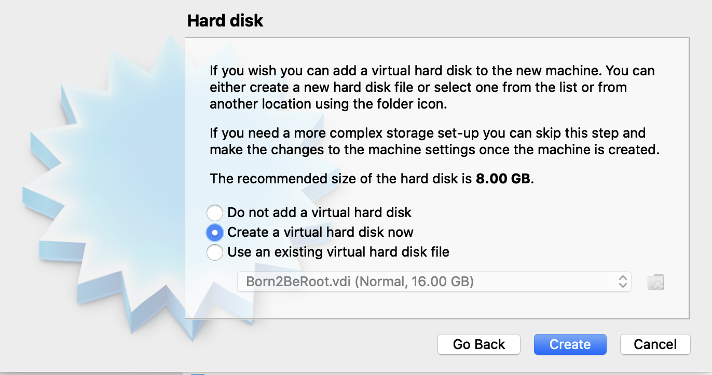

**Since I choose 1GB - 1024 MB, the recommended size of the hard disk is 8.GB**

   - Choose VDI (VirtualBox Disk Image)
  


   - Choose Dynamically allocated


   
   - File location and size

### Why 16GB?

Allocating 16GB for file storage ensures you have enough space for the operating system, applications, and additional files without filling up the entire disk. This leaves room for the system to operate smoothly and for future expansion if needed.


---

This is how it will be demonstrated after doing step 4


---

## Step 4: Configure Your VM


**1. Select Your VM:** Click on the name of your VM in the VirtualBox main window, then click "Settings".


**2. Storage:** In the Storage section, next to "Controller: IDE", click on the empty disk icon. Then, on the right side, click the disk icon next to "Optical Drive" and select "Choose a disk file...". Locate and select your downloaded Debian or Rocky ISO.


This is how it should look like when once you have selected your ISO


**3. Network:** Go to the Network section, and in Adapter 1, attached to NAT, ensure it's enabled. This setting will allow your VM to access the internet through your Mac.


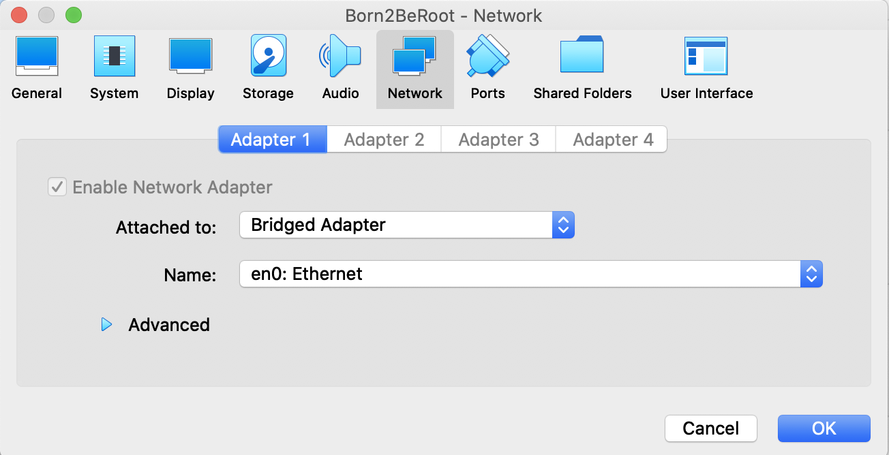


4. Save: Once you have configured your VM, click on OK


## Step 5: Install Debian or Rocky on Your VM

Start the VM: Click "Start" to boot your VM. You'll enter the installation process for Debian or Rocky.


## Installation process

---
**Remember** 

**Tab** -  Moves              
                        
**Space** - Selects          
                       
**Enter** - Activate buttons 

---

### Getting started
 
#### 1. Start Installation

Once you have click on "START", it might appear the following screen, click on "INSTALL"


#### 2. Choose Preferred Language

Choose the "preferred language" for the installation process


### Language and Location Configuration

#### 3. Choose Location

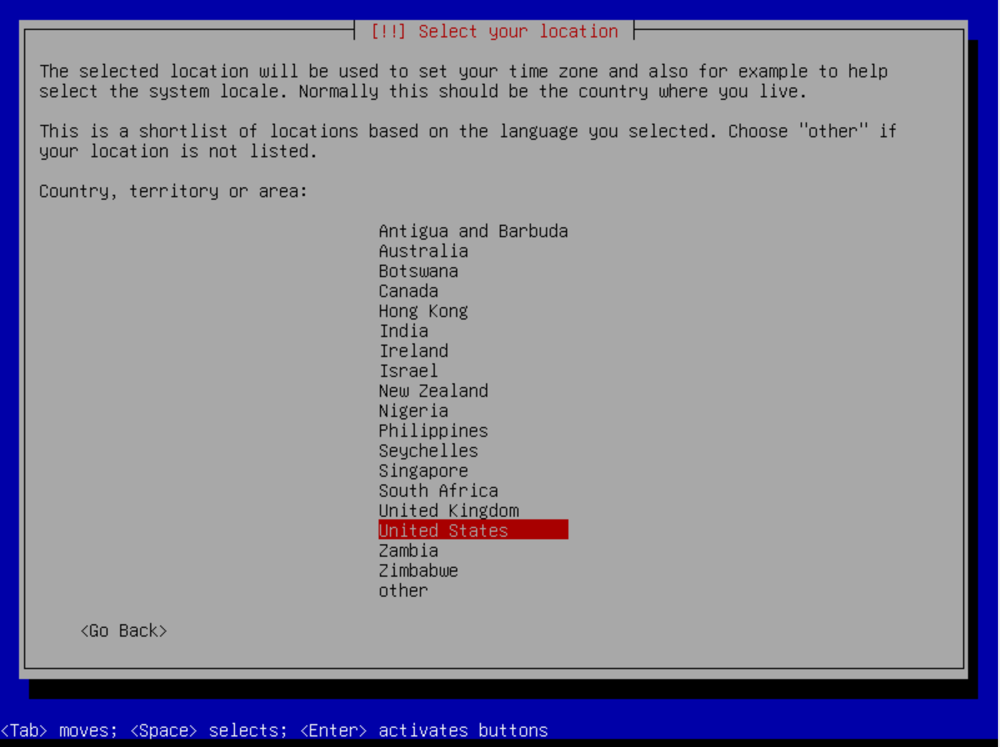


#### 4. Choose Continent or Region


#### 5. Choose Country

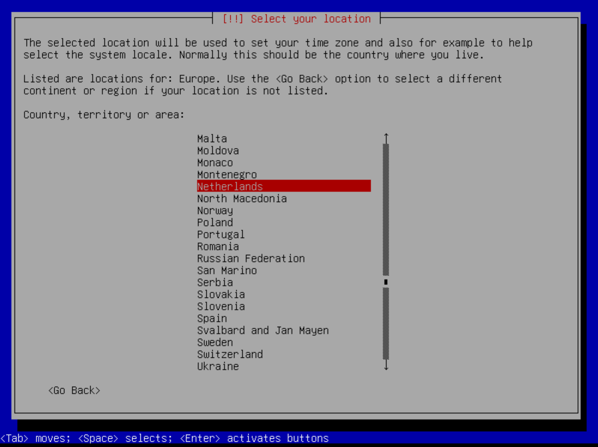

### User Configuration

#### 6. Configure Keyboard


#### 7. Choose Hostname

Remember, when writing the hostname must be "your intra login" + 42 

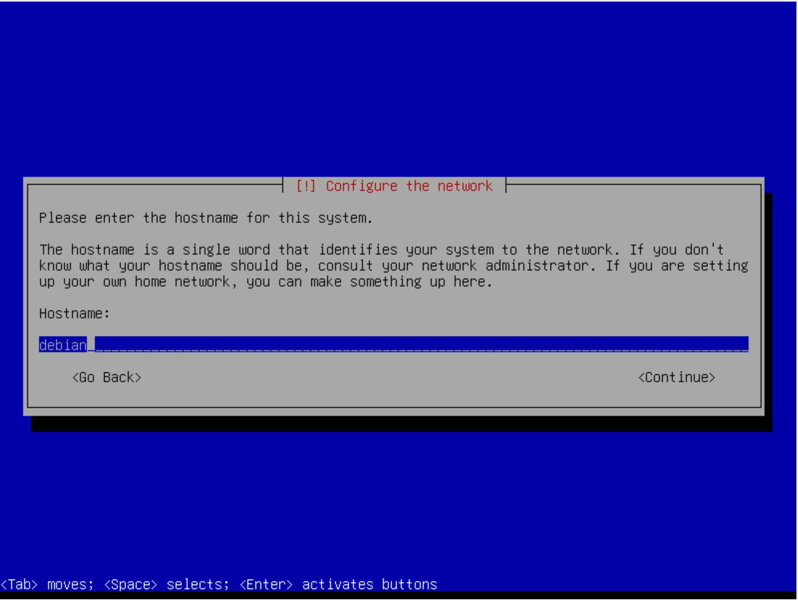

#### 8. Skip Domain Name


### Security Settings

#### 9. Set Up Root Password

Rememeber to save this password, it will be use it again.


#### 10. Re-enter Your Password


#### 11. Write Fullname for the New User

TIP: write your intra login


#### 12.Account Username

TIP: write your intra login again

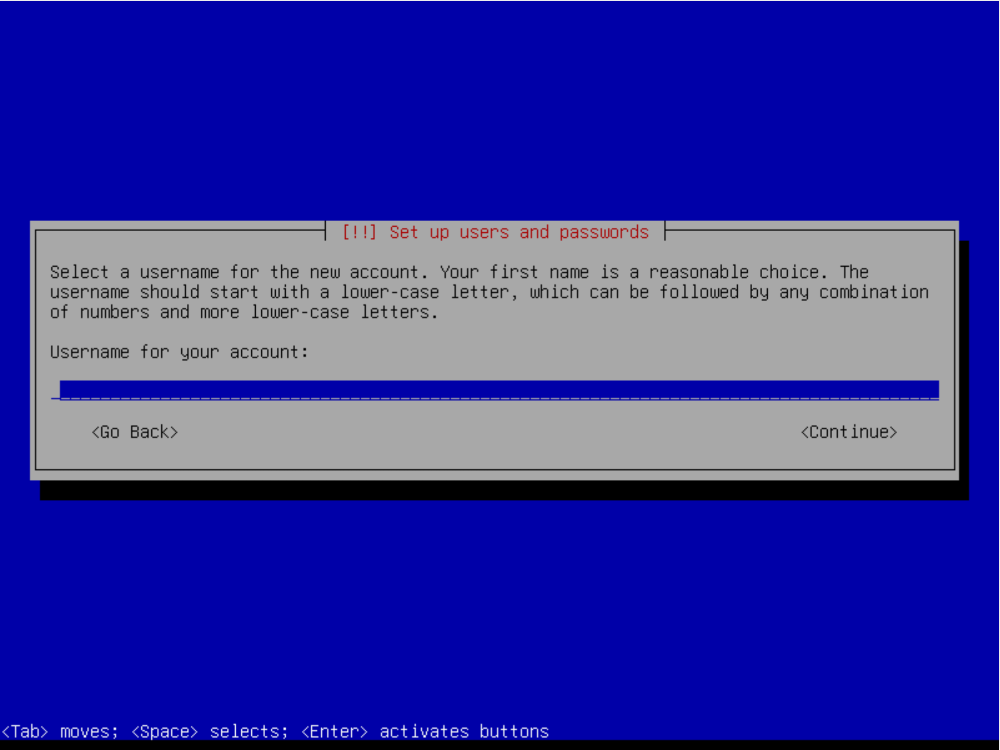


#### 13. Choose Password for New User

Rememeber to save this password, it will be use it again.


#### 14. Re-enter New User Password


#### 15. Select Time Zone Location

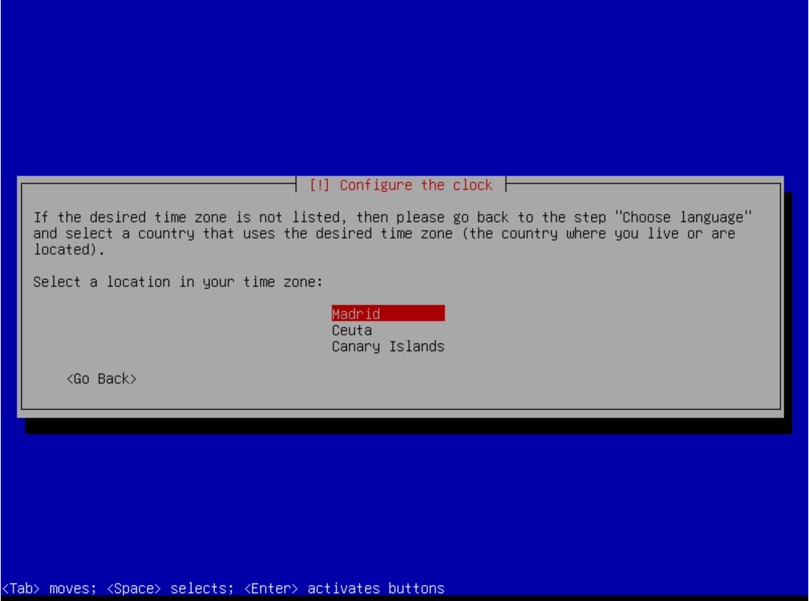

### Partitioning and Storage

#### 16. Select Partitioning Method

In this case, we are going to use the "manual" method since im going for the **BONUS PART**.

If you only want to complete the **MANDATORY PART**, choose "guided - use entire disk and set up encrypted LVM" since the partition MUST BE ENCRYPTED according to the subject.


#### 17. Manual Partitioning - Select Partition

Choose the third option -->  SCSI3 (0,0,0) (sda) - 17.2 GB (MEMORY SIZE) ATA VBOX HARDDISK


#### 18.Manual Partitioning - Create New Table

Choose the "YES" option 

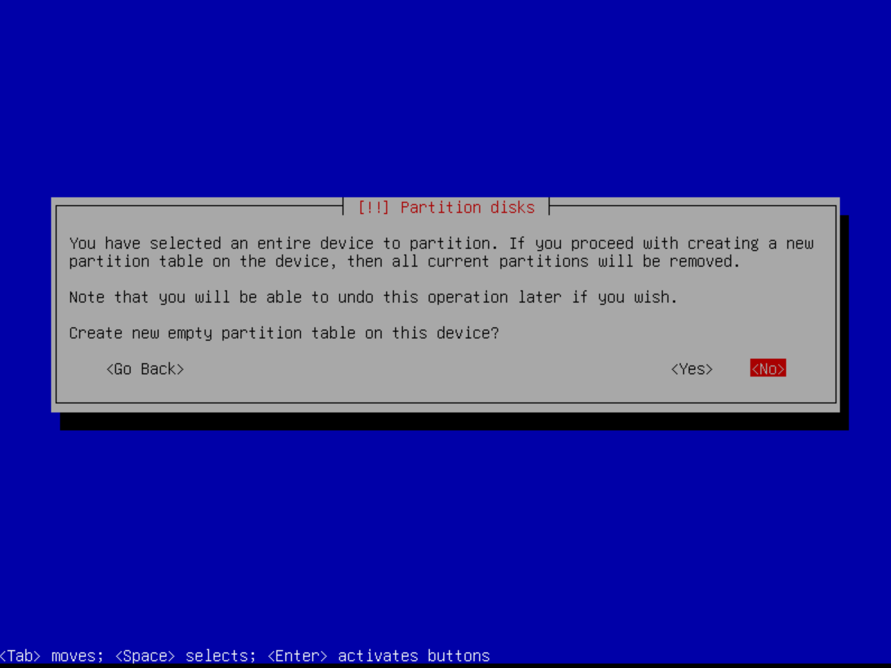


#### 19. Manual Partitioning - Choose Free Space


#### 20. Manual Partitioning - Use Free Space

Choose create a new partition

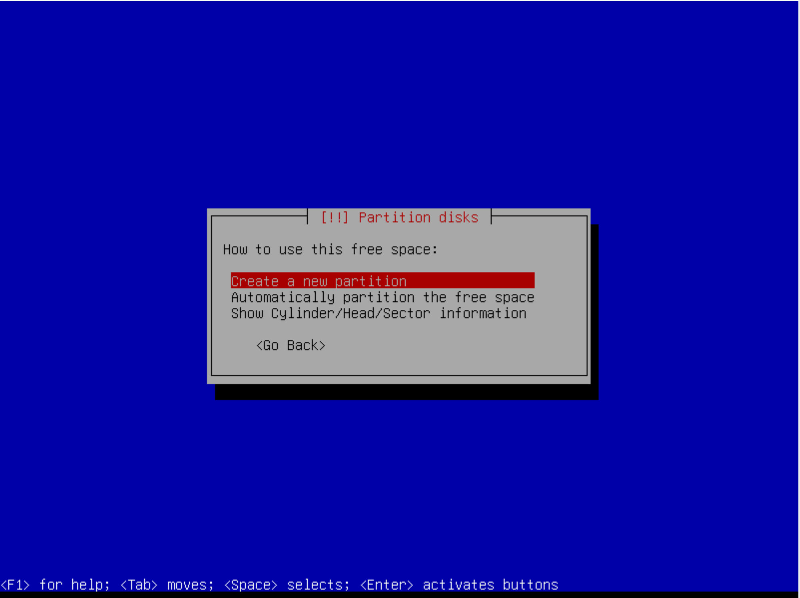

#### 21. Manual Partitioning - New Partition Size

Write 500MB

#### Why 500MB?

500 MB is a good size for this specific purpose. It's enough space to hold essential system files for starting up your computer and for recovery tools without taking up too much of your hard drive. This setup helps ensure your computer can boot up smoothly and has the necessary tools available in case you need to fix startup problems.


### 22. Manual Partitioning - Partition Type

Choose "PRIMARY"


#### What it is?

A primary partition is one of the main sections of your hard drive. You can install operating systems here, and your computer can boot from them. It's like a main room in a house where essential activities happen.

#### Limit

On older systems using the MBR (Master Boot Record) format, you can only have up to four primary partitions. It's like having only four main rooms in a house.

#### When to use

Primary Partitions are best for operating systems and essential system files. If you're setting up a new computer or installing a new OS, you'll likely use a primary partition.

#### 23. Manual Partitioning - Partition Location

Choose "BEGINNING"

#### Beginning or end?

- **Beginning of the disk:** Good for the system or programs because it might make your computer start and run a bit faster, especially on older computers with hard drives.
  
- **End of the disk:** Fine for storing your files, like music, videos, and documents. It doesn't really matter for speed, especially on newer computers with SSDs (which are like super-fast hard drives).
  
So, if you're setting up a place for your computer's system or programs, start at the beginning. If it's just for extra storage, the end is okay.


#### 24. Manual Partitioning - Partition Settings

You will find the following settings:


Follow the next steps:

- Click on mount point: /
- Inside of Mount point for this partition, choose **"/boot - static files of the boot loader"**
- Click on **"Done setting up the partition"**


It will be appear like this:


#### 25. Manual Partitioning - Second Disk

Select "pri/log 16/7 G - Free space" option


#### 26. Manual Partitioning - Use Second Disk Space

Choose create a new partition


#### 27. Manual Partitioning - Second Disk Size

Write max (lowercase)


#### 28. Manual Partitioning - Second Disk Type

Choose "LOGICAL"


#### What it is?
A logical partition exists within an extended partition. Think of an extended partition as a big room divided into smaller spaces. These smaller spaces are your logical partitions, where you can store files but typically don't boot an operating system from.

#### Purpose

They're used to bypass the limit of four primary partitions. You can have many logical partitions, allowing you to organize your data more flexibly, like having many smaller rooms for different purposes within a big room.

#### Limit

The number of logical partitions is only limited by the disk's size and the file system's capabilities.

#### When to use

They are great for organizing your files, like documents, music, and videos, especially if you've already used your primary partition slots or need more partitions than the four primary ones allowed.

#### 29. Setting Logical Partition


Follow the next steps:

- Click on mount point
- Click on "Do not mount it"
- Click on "Done setting up the partition"

It will appear like this:


### 30. Primary and Logical Setup Complete

After setting primary and logical partition, it should be looking like this:


---

#### Doubt: what is best first "configure the encrpted volumes and then configure the logical volume manager" or "configure the logical volume manager and then configure the encrpted volumes" ?

The best approach is usually to configure the Logical Volume Manager (LVM) first and then encrypt the volumes. This sequence offers several advantages:

- **Flexibility:** Setting up LVM first allows you to create, resize, and manage logical volumes easily. After these volumes are configured, you can apply encryption to the specific ones that need to store sensitive data. This way, you have the flexibility to encrypt only what's necessary.

- **Simplicity in Management:** Managing encrypted volumes can become more complex, especially if you need to adjust their size later. By having LVM set up first, you can manage the sizes and allocations of your volumes more easily, and then the encryption layer sits on top, securing the data within these flexible containers.

- **Performance Optimization:** You might not need to encrypt every volume. By configuring LVM first, you can choose to apply encryption selectively, potentially optimizing system performance since encryption can add overhead.

- **Better Organization:** This order helps in organizing your storage more logically. You can plan out your volume sizes and structures without being constrained by the encrypted containers, giving you a clearer layout of your storage needs and security requirements.

In summary, **setting up LVM first, then applying encryption to the necessary logical volumes, provides a more adaptable, manageable, and efficient system configuration.**

---

### LVM Configuration

#### 31. Configure LVM

It´s time to configure the LVM


##### LVM Overview

###### What It Is ?

- LVM is a tool for managing disk space flexibly, allowing you to change partition sizes and combine disks easily.

###### Key Benefits

- **Flexibility:**
   - Adjust Size: Change partition sizes without stopping your system.
   - Combine Disks: Merge several small disks into one large virtual disk for easier file management
- **Easy Management:**
   - Snapshots: Take a snapshot of your disk to restore it to a previous state if needed.
   - Move Data: Easily move data between disks without downtime.

###### How It Works:

- Physical Volumes (PV): Your actual hard drives/SSDs.
- Volume Groups (VG): A collection of PVs combined into a large virtual disk.
  
###### **Why Use LVM?**

- Ideal for those who need to adjust their storage space over time, like for servers or data-heavy users. Offers great control over disk space but requires some setup and management knowledge.

#### 32. LVM - Write Changes

Choose "YES"


#### 33. LVM Configuration Details

Follow the next steps:

Click on Display configuration details


#### 34. Volume Group Name

Write LVMGroup


#### 35. Choose Devices for Volume Group

Select **"/dev/mapper/sda5_crypt"**


#### 36. LVM - Finalize Changes

Choose "YES"


#### 37. Volume Configuration

This is how it appear on the screen


#### 38. Create Volume Group

When clicking again on "Create volume group", you might need to re-write the name of the volume group, which is LVMGroup.


**Just in case:** it is a good practice to verify that you have already created a name for the volume group. 

Important to check whether "used physical volumes and volume groups" has the number 1.

If it is created, it will appear the following message:


#### 39. Create Logical Volume

Select the volume group that is already createed "LVMGroup"


#### 40. Name Logical Volume

These are:
1. root (mandatory part)
2. swap (mandatory part)
3. home (mandatory part)
4. var  (bonus part)
5. srv (bonus part)
6. tmp (bonus part) 
7. var/log (bonus part)

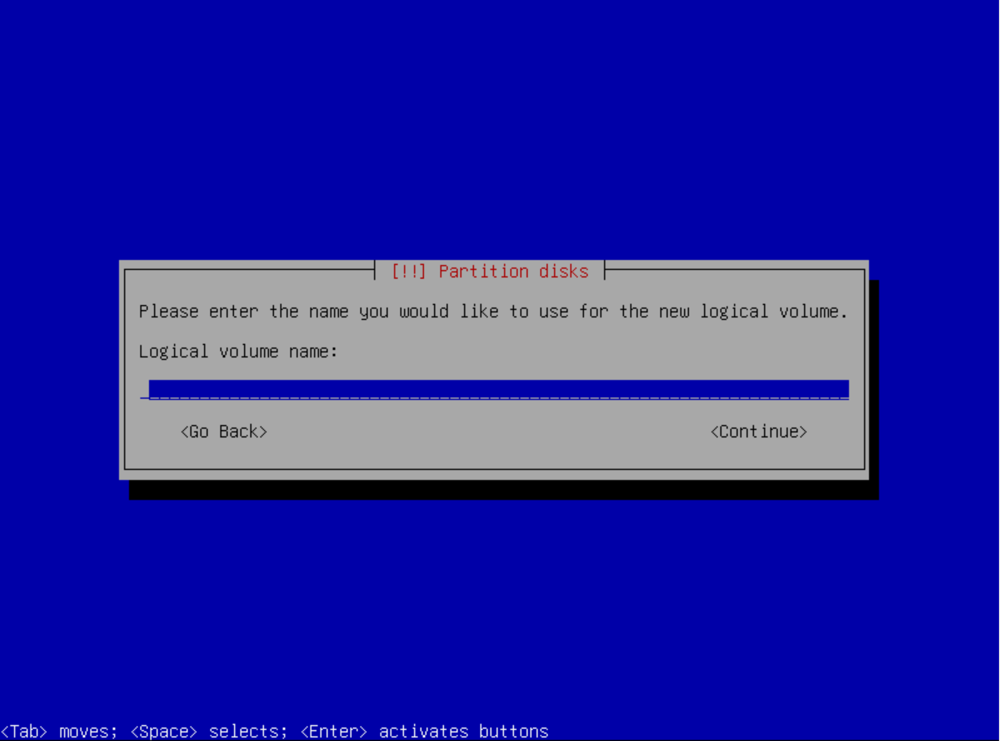

#### 41. Set Logical Volume Size

For 16 GB storage (why 16GB, check step 3 Create a New Virtual Machine: point 4)
- root - 5.2GB
- swap - 1.2GB
- home - 2.6GB
- var - 1.6GB
- srv- 1.6GB
- tmp - 1.6GB
- var-log - 2GB


--- 
Remember, for 40 and 41, please proceed with the following steps:

1. Select "create logical volume"
2. Write the name of the logical volume e.g root
3. Write the size of the logical volume chosen e.g root --> 5.2 GB
4. Select "create logical volume"
5. Do it as many times as needed, in this case do the same action 7 times.

--- 
#### 42. Complete Logical Volume Configuration

It will appear like this

Before continuing the following steps: check the summary of current LVM configuration

Volume Physical volumes 1
Volume groups 1
Logical volumes must be 7


#### 43. LVM Group Overview

It should appear like this


#### 44. Partition Configuration Overview

Taking consideration the image of step 43 "Overview of LVM group", you need to follow the next steps:

- Click on the line that it has the following information: #1 ... (as you can observe for each of the logical volumen name has a #1)
- Once you select #1..., you need to configure each of the partitions.

**REMEMBER** inside of partition settings click on **"USE AS: do not use"**

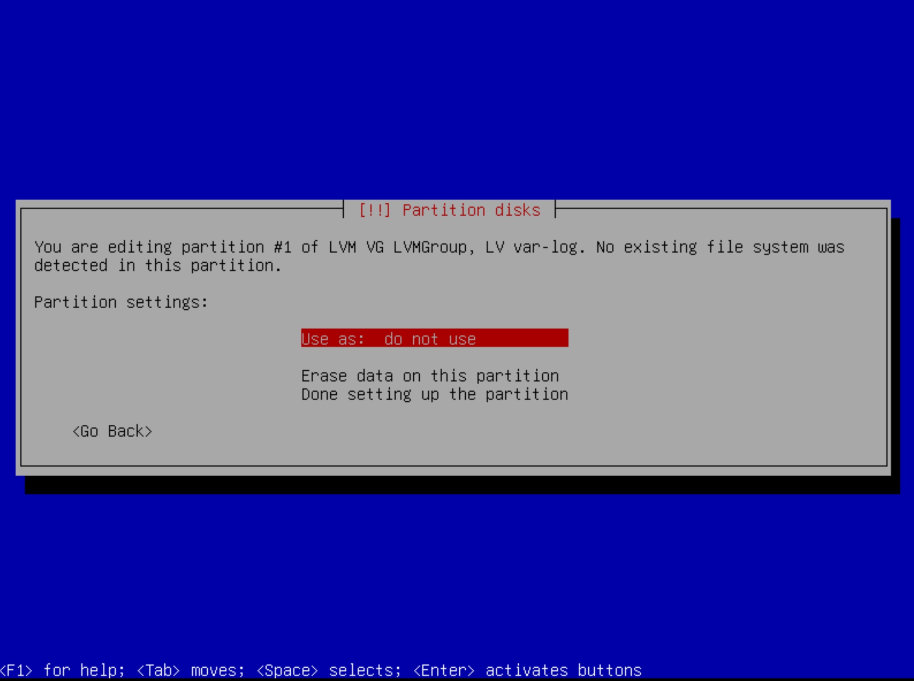


  These are:

   **1. root (mandatory part)** -- 1.Use as: Ext4 journaling file system / 2.mount point: / - the root file system / 3.Done setting up the partition 
   
   **2. swap (mandatory part)** -- 1.Use as: swap area / 2.Done setting up the partition 
   
   **3. home (mandatory part)** -- 1.Use as: Ext4 journaling file system / 2.mount point: /home - user home directories / 3.Done setting up the partition 
   
   **4. var  (bonus part)** -- 1.Use as: Ext4 journaling file system / 2.mount point: /var - variable data / 3.Done setting up the partition 
   
   **5. srv (bonus part)** -- 1.Use as: Ext4 journaling file system / 2. mount point: /srv - data for services provided by this system / 3.Done setting up the partition
   
   **6. tmp (bonus part)** -- 1.Use as: Ext4 journaling file system / 2.mount point: /tmp - temporary files / 3.Done setting up the partition
   
   **7. var/log (bonus part)** -- 1.Use as: Ext4 journaling file system / 2.mount point: enter manually (/var/log) / 3.Done setting up the partition 

Sample of partition settings


#### 45. Partition Settings Overview


Given the overview, if your intention is to secure the data on some or all of these logical volumes, the next step would indeed be to configure encrypted volumes. This will protect the data stored within those volumes by requiring a password or key to access it when the system boots up.

Here's what you might consider when proceeding with encryption:

- **Encrypt Specific Volumes:** Decide if you need to encrypt all volumes or only certain ones. For example, you might choose to only encrypt /home where user data is stored, or /var/log where sensitive logs are kept.

- **Use LVM Encryption Tools:** Tools like LUKS (Linux Unified Key Setup) can be used to encrypt logical volumes. This is typically done after the LVM setup because it allows for more flexibility in managing the volumes.

- **Performance Impact:** Keep in mind that encryption will have a performance impact, so encrypt only the necessary volumes to balance security and performance.

- **Backup Data:** Before proceeding with encryption, it's a good practice to back up any important data. Encryption processes can sometimes go wrong, and you don't want to risk losing your data.

#### 46. Format the partition case


The screenshot shows a partition editing screen from an installer, likely for a Linux distribution, where you are given the option to format the partition. The partition in question is labeled as LV tmp, which is commonly used as a temporary storage space (/tmp) by the operating system.

Here's what to consider when deciding whether to format the partition:

- **Purpose of /tmp Partition:** The /tmp directory is used for temporary file storage by the operating system and applications. Files stored in /tmp are not meant to be permanent and can be deleted between reboots or even during operation.

- **Existing Data:** If this is a fresh installation and there's no existing data that you need to keep on this partition, then it is usually safe to format it. Formatting will prepare the partition with a clean filesystem.

- **Data Retention:** If this is an existing system and you have data in /tmp that you need to keep (which is uncommon since /tmp is for temporary files), you should not format the partition. However, in most cases, /tmp can be safely formatted since it is not typically used for persistent storage.

- **System Requirements:** Some installers and systems expect a clean /tmp partition and may handle temporary data more efficiently if you start with a formatted partition.

Unless you have a specific reason to keep existing data in /tmp, which is unusual, you would generally choose to format the partition. Ensure that you have backups of any important data before proceeding with formatting any partitions.


### Encryption Configuration

#### 47. Configure Encrypted Volumes

Click on " Configure encrypted volumes"


#### 48. Encryption - Write Changes

Select "YES"


#### 49. Encryption Configuration Actions

Select "Create encrypted volues"

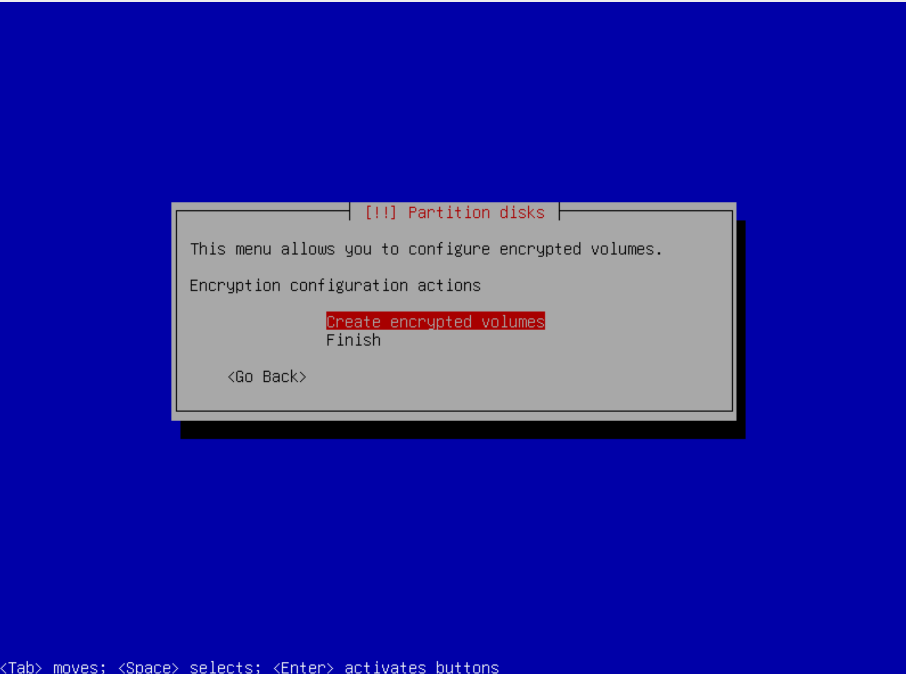


#### 50. Select Devices to Encrypt

Before choosing which device to encrypt, please read the following explanation:

**1. /home:** This is where your personal files and user-specific settings are stored. If you have sensitive data or documents, this is a **good candidate** for encryption.

**2. root (/):** The root directory contains all the files and folders of your operating system. **Encrypting this can add security, but it may also complicate the boot process and system recovery.**

**3. /srv:** This directory is for service-related files. **If you're running a server with sensitive data, you might encrypt it.** Otherwise, it's often not necessary.

**4. swap:** Swap space is used when your RAM is full. Encrypting swap is a **good idea because it can contain remnants of sensitive data**. However, it can slightly slow down the system when swapping occurs.

**5. /tmp:** Temporary files are stored here. These files are usually not sensitive and are frequently deleted, so encrypting this directory is generally not needed.

**6. /var:** This holds variable data like logs, emails, databases, and web pages served by your system. If there's sensitive data here, you might consider encryption.

**7. /var/log:** Log files are stored here. They can contain sensitive information about system usage and user activities. **Encrypting log files is good for security, especially if you're worried about someone accessing your usage patterns.**

##### What about /dev/sda1?

It usually refers to the first partition on the first hard drive recognized by the system. This can be used for different purposes depending on how you set up your system. Here's a simple breakdown:

**- /boot:** Often, /dev/sda1 is used as the /boot partition, which contains the essential files needed to start up (boot) the system. It includes the bootloader, the kernel, and the files necessary for the kernel to start up.

**- Encrypted /boot?:** Encrypting the /boot partition is generally not recommended for beginners because it can make the boot process more complex. If encryption is not set up correctly, it may prevent the system from starting. However, for very high-security environments, some advanced users do encrypt this partition.

**- Primary vs. Secondary Partitions:** On some systems, especially those that use Master Boot Record (MBR), /dev/sda1 might need to be a primary partition. If you're using a GUID Partition Table (GPT), which is more modern and flexible, this is less of a concern.

**- Encrypting /dev/sda1:** If /dev/sda1 is not your /boot partition and you are storing sensitive data on it, then you might consider encryption. But remember, if this is your first project and you're learning, it might be safer to start with encrypting home directories and other non-essential system partitions first.


Now, select the devices that you consider to be encrypted:


Select YES, and then select "Done setting up the partition" for each of the partitions.


#### 51. Format_the_partitition


#### 52. Confirm Data Erasure for Encryption

Select YES, for encryptation


#### 53. Erasing Data for Encryption

We need to wait a 15-25mins of minutes to overwrite the volume.


---

We need to repeat steps 49 and 50 for all the logical volumes we have chosen to encrypt.

---

#### 54. Enter Encryption Passphrase


#### 55. Review Encrypted Partition Overview


#### 56. Complete Overview of Encrypted Partition


Select **"finish parititioning and write changes to disk"**


## Post Installation Steps
   
### Error Handling and Troubleshooting


#### 57. In Case of Errors

How to fix it 

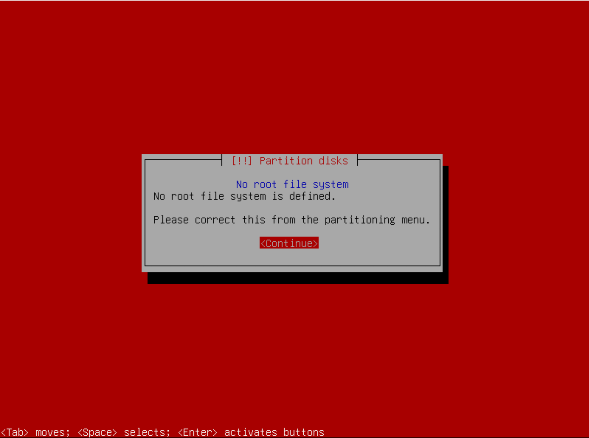

The message in your screenshot indicates that the installation process has encountered an issue: "No root file system is defined." This typically means that during the installation and partitioning phase, a root filesystem (/) has not been assigned to any partition. The root filesystem is essential because it's the top-level directory of the disk where the operating system files are stored.

To resolve this, you'll need to go back to the partitioning menu and designate a partition to be mounted as / (root). Here's what you can do:

- **Return to Partitioning Menu:** Go back to the partitioning menu in the installation process.

- **Select or Create a Partition:** Choose an existing partition or create a new one where you will install the operating system.

- **Assign Mount Point:** For the selected partition, set the mount point to /, which denotes the root filesystem.

- **Format the Partition (if necessary):** You may need to format the partition with a filesystem, typically ext4 for Linux systems.

- **Confirm and Write Changes:** Once you've correctly assigned the root filesystem, confirm your changes and proceed with the installation.


It's important during this process to ensure that you don't accidentally overwrite any other partitions you need, especially if you're dual-booting or have specific data partitions set up. If you're unsure, it might be helpful to consult documentation for the operating system you're installing or seek assistance from a community or support forum specific to that OS.


#### 58. Reconfigure LVM


Configure_VLMagain


#### 59. Complete Overview of Encrypted Partition


Select **"finish parititioning and write changes to disk"**


Do you want to return to the partition menu??

Select - No

#### 60. Write the changes to disks

Once you have selected "NO", it will appear the following screen:


Select "YES"

#### 61. Failed to attempt to encrypted volume


Since it failed several times i just aborted the installation by executing the comand 

### Repository and Network Configuration

#### 62. Scan Additional Installation Media

Select No, it is not necessary


#### 63. Select Mirror Country


#### 64. Select Debian Archive Mirror

Choose deb.debian.org


#### 65. Enter HTTP Proxy Information

Keep it in blank 


### Software Selection

#### 66. Software Installation Process


#### 67. Choose Software to Install


The options displayed in your screenshot are choices for software that you can install on your system. In short words, here's what each option represents:

- **Debian desktop environment:** The default desktop environment provided by Debian, which is usually GNOME.

- **GNOME:** A popular, user-friendly desktop environment with a focus on simplicity and accessibility.

- **Xfce:** A lightweight desktop environment that is fast and low on system resources, good for older machines.

- **GNOME Flashback:** A version of GNOME with a more traditional interface, reminiscent of older GNOME 2.x versions.

- **KDE Plasma:** A feature-rich and versatile desktop environment known for its customizability.

- **Cinnamon:** Originally from Linux Mint, offers a more traditional desktop layout with modern features.

- **MATE:** A continuation of GNOME 2, offering a classic desktop experience.

- **LXDE:** Another lightweight desktop environment, focusing on being fast and energy-efficient.

- **LXQt:** The next generation of LXDE, built using the Qt toolkit.

- **Web server:** Software for hosting websites, like Apache or Nginx.

- **SSH server:** Allows you to remotely connect to this machine via SSH, a protocol for secure system administration.

- **Standard system utilities:** Essential tools and utilities for basic system management and operation.


Only select SSH Server y standard system utilities. It is often by default GNOME and debian desktop environment


### Configuration boot grub

#### 68. Grub boot loader


Install the GRUB boot loader to your primary drive?

Select "YES"

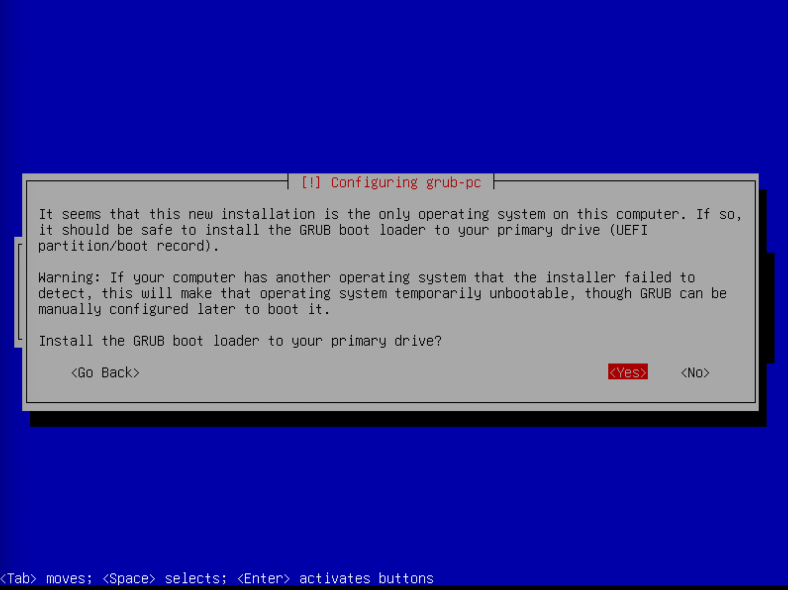


##### 69. Device for boot loader installation

Choose /dev/sda(ata-VBOX_Harddisk_VBb9aab8ab-1db392ef)


### Finishing installation

#### 70. Finish installation


#### 71. Installation complete

Choose continue


---


# 🥳​ **CONGRATULATIONS FOR REACHING THIS FAR!!** 🥳​

---


## Part 2️⃣: Operating System Configuration

In Part 2, we configure Debian on our VM, focusing on system updates, VirtualBox Guest Additions, user account management, and network settings for optimal connectivity and security. We also cover essential software installations, system security configurations like firewalls and antivirus, UI customization, shared folders setup, data backup strategies, and performance tuning. This phase ensures a secure, efficient, and tailored operating environment.

### Initial Setup and Access

#### 72. Starting VirtualBox


#### 73. Verifying User Credentials for System Access

Remember to revise steps 11 and 13


If you have successfully entered your username and password correctly, the following message will appear on your virtual machine:


#### 74. Understanding and Using User Prompts


##### Definition

A user prompt in the context of Unix or Linux operating systems refers to the command line interface (CLI) indication that the system is ready to accept commands. It typically appears in the terminal or console window, providing a text-based interface for the user to interact with the system. The prompt gives various pieces of information about the current state of the session, including the current user's identity, the hostname of the system, the current working directory, and other context-specific details.


##### Explanation

Here's a breakdown of the elements often included in a user prompt:

- **Username:** Indicates the identity of the logged-in user. This tells you which user account you're currently operating under.

- **Hostname:** Shows the name of the computer or system you're logged into. This is particularly useful when working across multiple machines, as it helps you keep track of where you're issuing commands.

- **Current Working Directory:** Often represented by symbols like ~ (for the user's home directory) or a full path, this part shows your current location in the system's file hierarchy. Knowing your current directory is crucial for file management and executing location-specific commands.

- **Prompt Symbol:** Typically a dollar sign ($) for regular users and a hash symbol (#) for the root (administrative) user. This symbol indicates the system's readiness to accept commands and also distinguishes between regular and elevated (root) privileges.


For example, in the prompt **anwuyan@anwuyan42:~$:**

- **anwuyan** is the username.
- **anwuyan42** is the hostname of the machine.
- **~** indicates that the current working directory is the user's home directory.
- **$** signifies that the user can now enter commands, and that they are operating under a regular user account, not as the root user.


When you see a prompt like this in a Unix or Linux system, it tells you several things about your current session:
- **Who you are logged in as:** This helps in understanding what permissions you have for performing tasks.
- **Where you are:** The current working directory symbol ~ shows you're in your home directory, a comfortable starting point for many tasks.
- **What you can do**: The dollar sign ($) at the end of the prompt indicates you're a regular user, not the root. You can execute most commands, applications, and access files you own or have permissions for. For actions requiring root privileges, you'd prepend your commands with sudo (and enter your password), assuming your user has sudo privileges.

### Gaining Administrative Access


#### 75. Using su to Switch Users

##### 🆕​ `SU` (Switch User) COMMAND

- Usage: su switches the current user context to another user, typically the root user, requiring you to enter the password of the user you are switching to.

##### Syntax:

- **su** (by itself) attempts to switch to the root user.
- **su [username]** switches to the specified user.
- **su -** provides an environment similar to what the root user would expect, including changing the current directory to the root's home -directory and setting up the root's environment variables.

##### Key Characteristics:

- **Full Environment Switch:** Unlike sudo, su switches to the root (or specified user's) environment completely, changing your user ID and environment variables to those of the target user.
- **Requires Target User's Password:** To switch users, you must know and enter the target user's password, not your own (unless configured otherwise).
- **Less Granular Control:** su does not provide the same level of command-specific control or logging as sudo.
- **Example Use:** Gaining full root access for a session of work requiring multiple administrative commands, rather than executing a single command.


After learning about the su command and its purpose, you should enter su in your virtual machine's terminal and input the root account's password when prompted.


#### 76. Understanding and Using Root User Prompts

A Root User Prompt in Unix or Linux operating systems signifies that the terminal or console session is being conducted with root privileges, which is the highest level of permissions available on the system. The root user, **also known as the superuser(SU)**, has unrestricted access to all commands and files within the operating system, and the ability to perform any administrative tasks without limitations.

Here's a breakdown, similar to the format you've provided:

- **Username:** root indicates the identity of the logged-in user. Being the root user, this account has unrestricted access to the system, capable of executing any command, modifying any file, and performing administrative tasks across the entire system.

- **Hostname:** anwuyan42 shows the name of the computer or system you're logged into. This detail is particularly useful when managing multiple machines, as it clearly identifies which system you're currently interacting with.

- **Current Working Directory:** /home/anwuyan is the full path that represents your current location within the system's file hierarchy. Unlike the ~ symbol, which denotes the home directory of the logged-in user (when used in a regular user's prompt), this full path explicitly shows that the root user is in the home directory of the anwuyan user. Understanding your current directory is crucial for managing files and executing commands that are directory-specific.

- **Prompt Symbol:** The hash symbol (#) at the end of the prompt signifies that the session has root privileges, ready to accept commands. This symbol differentiates the root user's prompt from a regular user's prompt, which ends with a dollar sign ($). The presence of # indicates that you're operating with the highest level of permissions, allowing for system-wide changes without restrictions.

In summary, the prompt root@anwuyan42:/home/anwuyan# communicates that:

- The current user is root, the system's superuser.
- The system's hostname is anwuyan42, identifying the specific machine in use.
- The current working directory is /home/anwuyan, showing that commands will affect this directory unless otherwise specified.
- The # symbol indicates readiness to accept commands with root-level privileges, highlighting the elevated status of the session.

### Package Management and sudo Installation

#### 77. Installing apt (Advance Package Tool) 

**Question** 

Does the current working directory (/home/anwuyan) have any impact on the installation of sudo using the apt command while logged in as the root user (root@anwuyan42)? If not, why?

**Answer**

No, the current working directory does not affect the installation of sudo using the apt command while logged in as the root user. The apt command works at the system level and is not dependent on the current directory. Therefore, whether you're in /home/anwuyan or any other directory, you can still use the apt command to install sudo.

##### 🆕 `APT` COMMAND

- `apt` stands for "**Advanced Package Tool**." It is a command-line tool used in Debian-based Linux distributions (such as Ubuntu) to manage software packages. apt provides **a simple way to install, upgrade, and remove software packages on a system**.

- It handles dependencies, ensuring that all necessary packages are installed or upgraded when needed. Additionally, apt maintains a local database of available packages and their versions, which it uses to determine the actions to perform when installing or upgrading software.

#### 78. Installing sudo on a Linux system


To install sudo on a Linux system, you can use the following command:

```bash
apt update && apt install sudo
```
__________________________________
##### Understanding apt update and apt install sudo: Updating Packages and Enabling Elevated Privileges

- **`apt update updates`** the package lists for upgrades or new installations, ensuring you have the latest version of the software available.
  
- **`apt install sudo`** installs the sudo package, which allows users to run programs with the security privileges of another user (normally -the superuser, root).

__________________

This is what it should look like on the screen if you have executed the command correctly:


##### 🆕 `SUDO`COMMAND

##### Description:

The `sudo` command in Unix-like operating systems stands for "superuser do". It allows users to execute commands with the privileges of another user, usually the superuser or root, as specified in the sudoers configuration file.

The sudo command is commonly used to perform administrative tasks that require elevated permissions while logged in as a regular user. It provides a way to execute specific commands as the root user without needing to switch to the root account permanently.

The basic syntax for using sudo is:

```bash
sudo [options] command [arguments]
```

Here, command refers to the command you want to execute with elevated privileges, and arguments are any additional options or arguments passed to the command.

To use sudo, users must be granted permission in the sudoers configuration file, which defines which users or groups are allowed to use sudo and what commands they can execute.

Overall, sudo enhances security by allowing controlled access to administrative commands while minimizing the need for users to log in directly as the root user, which could pose security risks.


#### 79. Sudo reboot command 

**Question** ❓​

"Is executing sudo reboot necessary after installing new software using apt install sudo or making changes to the system configuration?"

**Answer**

Executing sudo reboot in the terminal will indeed restart your system, but it's not necessary simply to apply changes made to the software environment or configuration files.

If you've installed new software or made changes that require a restart of specific services, you might need to restart those services instead. However, for most changes, including installing new packages like sudo, you don't need to restart your system or the terminal.

After installing sudo, you can start using it immediately in the same terminal session without needing to restart. Simply prefix the commands you want to run with sudo to execute them with elevated privileges.

If you're unsure whether a restart is needed after making changes, it's usually safe to continue using your system normally. If a restart is necessary, the system will typically prompt you or notify you accordingly.


#### 80. APT Check Verification


To verify that you have installed apt correctly on your system, you can follow these steps:

A. **Check Version:** You can check the version of apt installed on your system using the following command:

```bash
apt --verion
```


B. **Check Package Manager:** You can also use apt itself to check if it's working properly. For example, you can update the package lists to ensure apt can fetch information about available packages:

```bash
sudo apt update
```


C. **Install a Package:** You can further verify apt by installing a small package. For example, you can install the htop package, which is a simple interactive process viewer:

```bash
sudo apt install HTOP
```


If does not work properly execute the following command:

```bash
apt-get install -s htop
```


##### 🆕​ `HTOP` COMMAND 

`htop` is a command-line utility that provides an interactive and more advanced alternative to the traditional top command. It allows you to monitor system processes and resource usage (such as CPU, memory, and disk usage) in real-time.

Here are some key features of htop:

- **Interactive Interface:** Unlike top, htop provides a user-friendly, interactive interface where you can navigate through processes using arrow keys and perform actions such as killing processes or changing their priority.

- **Colorized Output:** htop displays information in colorized format, making it easier to distinguish between different types of processes and resource usage.

- **Sorting and Filtering:** You can sort processes by various criteria such as CPU usage, memory usage, or process name. Additionally, htop allows you to filter processes based on user-defined criteria.

- **Tree View:** htop displays processes in a hierarchical tree view, showing parent-child relationships between processes.

Overall, htop is a powerful tool for monitoring system performance and diagnosing issues related to resource usage. **However, if you aborted the installation due to concerns about memory usage, it's advisable to check your system's memory resources before running resource-intensive applications or utilities like htop. If your system is low on memory, running htop could potentially exacerbate performance issues.**


#### 81. Verifying sudo Installation and Configuration


After installing `sudo`, it's essential to verify that the installation was successful and to check its configuration. The next step involves switching back to the root user and running the command `sudo -V`. This command provides crucial information about the version of `sudo` installed, including any arguments passed during its configuration and details about plugins that may offer additional functionality.

##### Running the Command

You can run the `sudo -V` command from either `root@anwuyan42:/home/anwuyan#` or `root@anwuyan42:/#`. Both locations represent the root user's environment and are suitable for executing this command. If you're currently in a specific directory (e.g., `/home/anwuyan`) and prefer consistency with your location, you can run the command from there. Alternatively, if you prefer the more standard root directory (`/`), you can switch to that directory and execute the command from there.

##### Handling Long Output

If the output of `sudo -V` is too long to display on the terminal at once, you can redirect the output to a file using `sudo -V > file.txt` and then view the contents of the file using a text editor like `nano file.txt`. This allows for easier examination of the output and ensures that no important information is overlooked.

Verifying the installation and configuration of `sudo` is crucial to ensure that it functions correctly and provides the necessary privileges for users. This step confirms that `sudo` is set up properly and ready for use in managing system tasks with elevated permissions.


​**🆕​ `SUDO -V` COMMAND**

It displays information about the version of sudo installed on your system, as well as additional configuration details. Here's a breakdown of the information typically displayed:

- **Sudo Version:** The output will include the version number of the sudo package installed on your system.

- **Arguments Passed During Configuration:** It will show any arguments that were passed during the configuration of sudo, such as compile-time options or customization settings.

- **Plugins:** The output may include information about any plugins that are enabled or available for sudo. Plugins can provide additional functionality or extend the capabilities of sudo, such as logging, authentication methods, or policy enforcement.

- **Optional Features:** It may also display information about optional features compiled into sudo, such as support for specific authentication mechanisms or logging facilities.

- **Security Features:** Some versions of sudo may display information about security features, such as whether it is built with support for SELinux or other security-enhancing technologies.


Here´s the visual representation:

In this scenario, the output of `sudo -V` was redirected to a file named `file.txt`. 


To view the contents of file.txt, you can use a text editor such as `nano`, `vim`, `cat`, or any other preferred text editor.

For example, you can use nano to view the contents of file.txt by running:

```bash
nano file.txt
```

### User Management

#### 82. Creating a User with Your Login Name

To add a new user to your system, utilize the command sudo adduser username, replacing "username" with the desired name for the new user. For instance, to create a user named "anwuyan1," execute:


```bash
sudo adduser anwuyan1
```

Following these instructions, you need to execute the command sudo adduser login in the root user context. This command will attempt to create a new user with the username "anwuyan1".

To add a new user to your system, execute the command sudo adduser login in the root user context. This command will prompt you to provide a password for the new user along with other configuration options. Upon completion, a new user with the username "login" will be created on the system.


After successfully updating the password for the new user, the system will prompt you to enter additional information for the user. In this case, input the relevant user information for "anwuyan1".


However, if you've already created a user with that username during the installation process, you'll receive a message indicating that the user already exists.


So, execute the command sudo adduser login as instructed to attempt creating the user, and if the user already exists, you'll receive a notification confirming that.


#### 83. Adding a User to a Group

Following the user creation process, we need to create a new group named "user42," We need to execute the command sudo addgroup user42 to add the user "user42" to a group.


```bash
sudo addgroup user42 
```


##### What does GRID mean 🆔​ ?

`GRID` or Group IDs are numerical identifiers assigned to groups in Unix-like operating systems. They are used internally by the system to identify groups. When you see "grid 1002," it indicates that the group "grid" has a group ID of 1002.

In Unix-like systems, including Linux, groups are managed by their numerical group IDs (GIDs) and their corresponding names. The GID is what the system uses to identify and manage the group, while the name is what is more commonly used by users and administrators to reference the group.


#### 84. Verifying User Group Creation


After adding user groups, it's essential to verify that the process was successful. You can use several methods to ensure the groups were created correctly and include the intended users.


**🆕​ GETENT COMMAND**

The getent command is short for **"get entries"**. It is a Unix command-line utility that retrieves entries from various databases configured in the system's Name Service Switch (NSS) configuration file. These databases typically include user accounts, groups, hosts, services, and others.

When you use getent with specific parameters such as passwd, group, or hosts, it fetches information from the corresponding database. For example:

- **`getent passwd`** retrieves information about user accounts.
  
- **`getent group retrieves`** information about groups.
  
- **`getent hosts retrieves`** information about hosts (IP addresses and corresponding hostnames).

##### Using getent Command:


```bash
getent group groupname
```


Replace groupname with the name of the group you want to check. This command retrieves information about the specified group from the system's group database. If the group exists, its details will be displayed.

##### Listing All Groups:


```bash
getent group
```


##### Adding User to Multiple Groups Using usermod Command:


The `usermod` command in Linux is utilized to modify user account properties. When used with the -aG options, it allows appending a user to supplementary groups without altering their primary group. This is particularly useful for granting users additional permissions and access rights across multiple groups.

```bash
sudo usermod -aG sudo username
```

This command adds the user specified by username to the supplementary group sudo using the usermod command with the following options:

**`-a`:** Appends the user to the group without removing them from other groups.

**`-G sudo`:** Specifies the group to which the user will be added, in this case, the sudo group.

```bash
sudo usermod -aG user42 username
```

This command adds the user specified by username to the supplementary group user42 using the usermod command with the same options as above:

**`-a`:** Appends the user to the group without removing them from other groups.

**`-G user42`:** Specifies the group to which the user will be added, in this case, the user42 group.


This command lists all groups present on the system without specifying a particular group name. Reviewing this list allows you to confirm the addition of new groups.

##### Checking the Group File:

```bash
cat /etc/group | grep groupname
```

Replace groupname with the name of the group you want to check. This command searches the /etc/group file for the specified group name. If the group was successfully added, its entry will be displayed.

##### Editing the Group File with Nano:


```bash
sudo nano /etc/group
```

This command opens the /etc/group file in the Nano text editor, allowing you to manually inspect the group information. Be cautious when editing system configuration files to avoid unintended changes.

By employing these commands, you can ensure that the user groups have been created as intended and verify their properties, including group ID (GID) and membership of specific users.


#### 85. Verifying User Group Memberships for Corresponding Usernames


After confirming the user group memberships, the next step is to proceed with configuring the SSH terminal.


### SSH Configuration

#### 86. Executing sudo apt update During SSH Terminal Configuration

When starting to configure the SSH terminal, it's generally better to execute the sudo apt update command as the root user, regardless of whether you're inside the /root directory or any other directory.

Here's why:

- **Root Privileges:** The sudo command allows you to execute commands with superuser privileges. When you run sudo apt update, you're instructing the system to update the package lists with elevated permissions. This ensures that the update process can access and modify system files and configurations as needed.

- **Consistency:** Executing commands as the root user ensures consistency in the configuration process. Since SSH terminal configuration often involves modifying system-level settings and configurations, it's recommended to perform all related tasks with root privileges to avoid permission issues or inconsistencies.

Therefore, whether you're in the /root directory or any other directory, running sudo apt update as the root user ensures that you have the necessary permissions to update package lists and proceed with configuring the SSH terminal smoothly.


```bash
sudo apt update
```

This command updates the local package lists from the repositories, ensuring that you have the latest information about available packages and their versions. It's a good practice to run this command before installing any new packages to ensure that you're installing the most recent versions.


#### 87. Installing OpenSSH Server

Once the package lists are updated, you can proceed to install the OpenSSH server. This command installs the OpenSSH server software, which allows remote users to securely connect to your system via SSH. Installing the SSH server enables remote access to your system, making it an essential step if you plan to manage the system remotely.


```bash
sudo apt install openssh-server
```


**🆕​ SSH (Secure Shell)**

`SSH` stands for Secure Shell. It is a cryptographic network protocol that provides a secure way to access and manage remote devices over an unsecured network, such as the internet. SSH allows users to securely log in to a remote system and execute commands as if they were directly connected to that system's console.

Key features of SSH include:

- **Encryption:** SSH encrypts all data transmitted between the client and the server, including authentication credentials, commands, and data exchanged during the session. This ensures confidentiality and prevents eavesdropping by unauthorized parties.

- **Authentication:** SSH supports various authentication methods, including password-based authentication and public key authentication. Public key authentication offers higher security by using asymmetric cryptography to authenticate users without transmitting passwords over the network.

- **Secure Remote Access:** SSH provides a secure method for remotely accessing and managing servers, routers, switches, and other network devices. It allows administrators to perform administrative tasks, transfer files, and troubleshoot systems remotely.

- **Port Forwarding:** SSH supports port forwarding, also known as SSH tunneling, which enables secure communication between two endpoints through an encrypted SSH connection. This feature is useful for securely accessing services running on remote systems or bypassing network restrictions.

----
Some commonly used SSH (Secure Shell) commands along with their explanations:

**Connect to a Remote Host:**

- **`ssh user@hostname`**: Establishes an SSH connection to a remote host. Replace user with your username and hostname with the hostname or IP address of the remote server.

**Specifying Port:**
- **`ssh -p port user@hostname`**: Connects to a remote host on a specific port. Replace port with the port number.

**Interactive Shell:**
- **`ssh user@hostname command`**: Executes a single command on the remote server and exits.
- **`ssh user@hostname`**: Opens an interactive shell session on the remote server.

**Copying Files Over SSH:**
- **`scp file user@hostname:/remote/path`**: Copies a file from the local system to the remote server.
- **`scp user@hostname:/remote/path/file /local/path`**: Copies a file from the remote server to the local system.

**SSH Key Management:**
- **`ssh-keygen`**: Generates SSH key pairs for authentication.
- **`ssh-copy-id user@hostname`**: Copies the public key to the remote server's authorized keys file for passwordless authentication.

**Tunneling and Port Forwarding:**
- **`ssh -L local_port:destination:dest_port user@hostname`**: Sets up local port forwarding.
- **`ssh -R remote_port:destination:dest_port user@hostname`**: Sets up remote port forwarding.

**Configuring SSH:**
- **`/etc/ssh/sshd_config`**: Configuration file for the SSH server.
- **`~/.ssh/config`**: Configuration file for SSH client options.

---

#### 88. Verifying SSH Terminal Installation and Configuration

After installing the SSH terminal, the next crucial step is to ensure that it's configured correctly and ready for use. Here's how to verify the installation 

Use the command `sudo service ssh status` to check the status of the SSH service. This command will indicate whether the SSH service is installed and running properly on your system. If the service is active and running, it indicates that SSH terminal installation was successful.

```bash
sudo service ssh status
```


#### 89. Configuring SSH Terminal Service

If the SSH service is running, proceed with configuring SSH to meet your specific requirements. This may include modifying the SSH server configuration file (/etc/ssh/sshd_config) to adjust settings such as port numbers, authentication methods, access controls, and more.


#### 90. Editing SSH Server Configuration

Two requirements:

- **Configure SSH server to listen on port 4242:**
  
   - Open the SSH server configuration file located at /etc/ssh/sshd_config.
     
   - Locate the Port directive and change the port number to 4242.
     
   - Save the file and exit the text editor.
     

- **Disable direct root login via SSH:**
  
   - In the same SSH server configuration file (/etc/ssh/sshd_config), find the PermitRootLogin directive.
     
   - Change its value to no to disallow direct root login.
     
   - Save the changes and exit the text editor.

     
To configure the SSH server, you'll need to edit the /etc/ssh/sshd_config file. If you're not logged in as the root user, you may not have permission to edit this file directly. In that case, you can use the sudo command to run the text editor with elevated privileges.

Here's how to do it:

If you want to edit the file as the root user:

```bash
su
nano /etc/ssh/sshd_config
```

Enter the root password when prompted.


If you prefer to use sudo:

```bash
sudo nano /etc/ssh/sshd_config
```
Enter your password when prompted.

Using the Nano text editor (or another text editor of your choice), you can then make the necessary changes to the SSH server configuration to meet your requirements. Remember to save the changes before exiting the editor.


🚨 When you see lines starting with `#` in `/etc/ssh/sshd_config`, it means that **those lines are commented out**, and their configurations are not active. These commented lines may include default configuration options or explanations about various settings.

To activate a commented-out configuration option, you would typically **remove the # symbol from the beginning of the line**. Once uncommented, the configuration option becomes active and takes effect when the SSH server is restarted or reloaded.


**It is expected to resemble this**


#### 91. Restarting SSH Service and Verification


Restart the SSH service to apply the changes made to the configuration. Use the command:

```bash
sudo service ssh restart
```

After restarting the SSH service, check the current status to ensure that the service has restarted successfully and that the changes have been applied. Use the command:

```bash
sudo service ssh status
```

Confirm that the SSH server is now listening on port 4242. You can do this by examining the output of the status command. The line indicating the port should show "Port 4242" to confirm that the SSH server is indeed listening on the new port.


**It is expected to resemble this**


###  Firewall Setup


#### 92. Setting Up UFW (Uncomplicated Firewall)

The next crucial step in securing your system is to set up UFW (Uncomplicated Firewall), a user-friendly interface for managing iptables firewall rules on Ubuntu.

Here's how to proceed:

- Use the following command to install UFW:

```bash
sudo apt install ufw
```


- When prompted, type 'y' to confirm the installation, and then press Enter.


- Wait for the installation process to complete. UFW will be installed along with its dependencies.


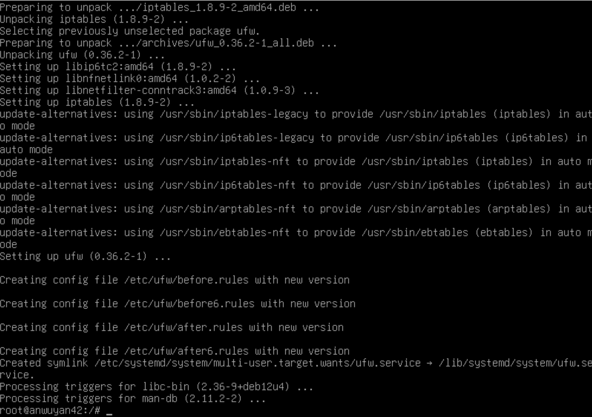


**🆕​ UFW COMMAND**

UFW stands for **Uncomplicated Firewall**. It is a user-friendly command-line utility for managing firewall rules on Linux systems, particularly on Ubuntu and other Debian-based distributions. UFW provides a simplified interface for configuring iptables, which is the standard firewall configuration tool for Linux.

With UFW, users can easily define rules to allow or deny incoming and outgoing traffic based on ports, IP addresses, protocols, and more. It simplifies the process of configuring firewall rules, making it accessible even to users without extensive networking knowledge.

---
Some commonly used  UFW commands along with their explanations:

**Enabling UFW:**
- **`sudo ufw enable`**: This command activates the UFW firewall, turning on the firewall and applying any configured rules.

**Disabling UFW:**

- **`sudo ufw disable`**: This command deactivates the UFW firewall, turning off the firewall and allowing all traffic.

**Checking UFW Status:**

- **`sudo ufw status`**: This command displays the current status of the UFW firewall, including enabled or disabled status, as well as the configured rules.

**Adding Firewall Rules:**

- **`sudo ufw allow <port>/<protocol>`**: This command allows incoming traffic on a specific port and protocol.
- **`sudo ufw deny <port>/<protocol>`**: This command blocks incoming traffic on a specific port and protocol.
- **`sudo ufw allow from <IP_address>`**: This command allows incoming traffic from a specific IP address.
- **`sudo ufw deny from <IP_address>`**: This command blocks incoming traffic from a specific IP address.
- **`sudo ufw allow <port>/<protocol> to <IP_address>`**: This command allows incoming traffic on a specific port and protocol only from a specific IP address.

**Deleting Firewall Rules:**

- **`sudo ufw delete <rule_number>`**: This command deletes a specific firewall rule identified by its rule number.

**Resetting UFW:**

- **`sudo ufw reset`**: This command resets UFW to its default configuration, removing all rules and disabling the firewall.

**Viewing UFW Help:**
- **`sudo ufw --help`**: This command displays the help menu for UFW, providing information about available commands and their usage.

---

#### 93. Enabling UFW Firewall Protection

After installing UFW (Uncomplicated Firewall) on your system using sudo apt install ufw, the next step is typically to enable the firewall with the following command:

```bash
sudo ufw enable
```

Enabling UFW activates the firewall and applies any configured rules, providing a basic level of security for your system. After enabling UFW, you can proceed to configure firewall rules to allow or deny specific types of traffic according to your requirements.


#### 94. Allowing Connections on Port

After enabling the UFW (Uncomplicated Firewall) on your system, the next step is to configure it to allow incoming connections, in our case 4242. This port may be used for various services or applications that you want to access or host on your system.


By executing the following command:


```bash
sudo ufw allow 4242
```


you are instructing UFW to add a rule that permits incoming connections on port 4242. This ensures that traffic directed to this port is allowed through the firewall, allowing you to establish connections or services that utilize this port.


Configuring UFW to allow specific ports while blocking others helps enhance the security of your system by controlling which network traffic is permitted to enter or leave your system. It's essential to carefully manage firewall rules to ensure that only necessary connections are allowed, minimizing the risk of unauthorized access or malicious activity.


#### 95. Verifying UFW Status

After configuring the UFW (Uncomplicated Firewall) to allow incoming connections on port 4242, it's essential to verify the status of UFW to ensure that the changes have been applied correctly. Use the following command to check the current status:

```bash
sudo ufw status
```

This command will display the current status of the UFW firewall, including whether it is enabled or disabled, as well as the configured rules. By examining the status output, you can confirm that the firewall is active and that the rule allowing connections on port 4242 has been successfully applied.


### Configuring Sudo Settings


#### 96. Strengthening System Security: Creating a Strong Password

The next step is to create a file in the directory /etc/sudoers.d/ called sudo_config, where the password configuration will be stored. 

You can use the command:

```bash
sudo touch /etc/sudoers.d/sudo_config
```

This command will create an empty file named sudo_config in the specified directory. After creating this file, you can proceed with configuring the password settings as needed.


#### 97. Creating sudo Directory for Command Logs


The next step you need to create a directory named sudo in the /var/log directory to store the input and output logs of commands executed with sudo.

You can create the directory using the following command:

```bash
sudo mkdir /var/log/sudo
```

This command will create a directory named sudo within the /var/log directory. After creating this directory, sudo command logs will be stored there.

--- 

**💡​ Did you know?**

The command `mkdir /var/log/sudo` is used to create a directory named "sudo" within the "/var/log" directory. This directory is specifically designated to store logs related to commands executed with sudo privileges.

When you execute commands with sudo, which allows you to perform actions as the root user or another specified user with elevated privileges, it's important to log these actions for security and audit purposes. Creating a dedicated directory for sudo logs helps organize and manage these logs effectively.

By creating this directory, you ensure that logs related to sudo commands are stored separately from other system logs, making it easier to locate and review them when needed. Additionally, having a centralized location for sudo logs can simplify log management and analysis processes, enhancing overall system security and accountability.


--- 


#### 98. Editing the sudo Configuration File


The next step is to edit the file created in step 1, which is /etc/sudoers.d/sudo_config. You can use your preferred text editor for this task, but in this case, the instruction suggests using nano.

To edit the file using the nano text editor, you can use the command:

```bash
sudo nano /etc/sudoers.d/sudo_config
```

This command will open the sudo_config file in the nano text editor, allowing you to make the necessary configurations related to sudo password settings.


To meet the requirements, we must incorporate the following command:


- **`Defaults  passwd_tries=3`**
This command sets the maximum number of password tries for a user using sudo to 3. After 3 failed attempts, the user will be locked out temporarily.

- **`Defaults  badpass_message="Wrong password"`**
This command sets a custom error message to be displayed when a user enters an incorrect password while using sudo.

- **`Defaults  logfile="/var/log/sudo/sudo_config"`**
This specifies the path where sudo command logs will be stored. In this case, logs will be stored in the /var/log/sudo/sudo_config file.

- **`Defaults  log_input, log_output`**
These options enable logging of both input and output for commands executed with sudo. This helps in auditing and tracking user actions.

- **`Defaults  iolog_dir="/var/log/sudo"`**
This command specifies the directory where I/O logs for sudo commands will be stored. In this case, logs will be stored in the /var/log/sudo directory.

- **`Defaults  requiretty`**
This option requires that the user must have a tty (terminal) associated with their session in order to use sudo. It enhances security by preventing sudo usage from non-interactive sessions.

- **`Defaults  secure_path="/usr/local/sbin:/usr/local/bin:/usr/sbin:/usr/bin:/sbin:/bin:/snap/bin"`**
These commands collectively configure various settings related to password requirements, error messages, logging, and security paths for sudo usage, ensuring a more secure and auditable sudo environment.


#### 99. Verification of Sudo Configuration Changes

After adding these commands to the sudo configuration file (/etc/sudoers.d/sudo_config), you can verify if they were executed correctly by checking the following:

- **Syntax Errors:** Ensure there are no syntax errors in the file. Any syntax errors could cause sudo to fail to parse the file, resulting in unexpected behavior.

- **Log Files:** Check the log files specified in the configuration. For example, verify that logs are being written to "/var/log/sudo/sudo_config" and "/var/log/sudo". You can use the tail command to view the recent entries in the log files.

- **Error Messages:** If there are any errors in the sudo configuration, they might be logged in system logs such as /var/log/messages or /var/log/syslog. Look for any error messages related to sudo configuration.

- **Password Tries:** Test the password tries setting by attempting to use sudo with an incorrect password multiple times. Ensure that after reaching the maximum number of tries (3 in this case), sudo denies access and displays the custom error message.

- **Requiretty:** Test whether requiretty is functioning as expected. Try running a sudo command from a non-interactive session (such as a script) and verify that it fails due to the requiretty setting.

- **Secure Path:** Check that the secure_path setting is applied correctly by running sudo with various commands and verifying that it executes commands only from the specified directories in the secure_path.

By performing these checks, you can ensure that the sudo configuration changes have been applied correctly and are functioning as intended.


### Strong Password Policy Configuration


#### 100. Editing the login.defs File 

The first step in configuring a strong password policy would typically involve editing the login.defs file. This file contains various parameters related to system login and password policies on Linux systems.

You can edit the the login.defs file using the following command:

```bash
sudo nano /etc/login.defs
```

Here's a breakdown of each component:

- **`sudo`**: This command allows you to execute the subsequent command with superuser (administrator) privileges.
  
- **`nano`**: Nano is a simple and easy-to-use text editor available on most Unix-like systems. It's invoked here to open the specified file.
  
- **`/etc/login.defs`**: This is the path to the file being opened. In this case, it's the login.defs file located in the /etc directory. This file typically contains configuration settings related to user login and password policies.


#### 101. Configuring Strong Password Policy in login.defs File

Inside the file, find and modify the following parameters to meet the requirements:

```bash
PASS_MAX_DAYS 30        # Set maximum password age to 30 days (this can be found)
PASS_MIN_DAYS 2         # Set minimum number of days before password change to 2 (this can be found)
PASS_WARN_AGE 7         # Set password expiration warning period to 7 days (this can be found)

# Set password complexity rules
ENCRYPT_METHOD SHA512   # Use SHA512 encryption method (if not already set) (this can be found)
MINLEN 10               # Set minimum password length to 10 characters (NOT FOUND IN THIS FILE)
DIFOK 7                 # Set number of characters that must differ from previous password to 7 (NOT FOUND IN THIS FILE)
```


#### 102. Installing Required Packages for Password Policy Configuration

To proceed with the configuration, we need to install the necessary packages. The following command:

```bash
sudo apt install libpam-pwquality
```

It installs the libpam-pwquality package, which provides the PAM (Pluggable Authentication Modules) password quality module needed to enforce the desired password policy. By running sudo apt install libpam-pwquality and confirming the installation with 'Y', the package will be installed, allowing us to proceed with the configuration.

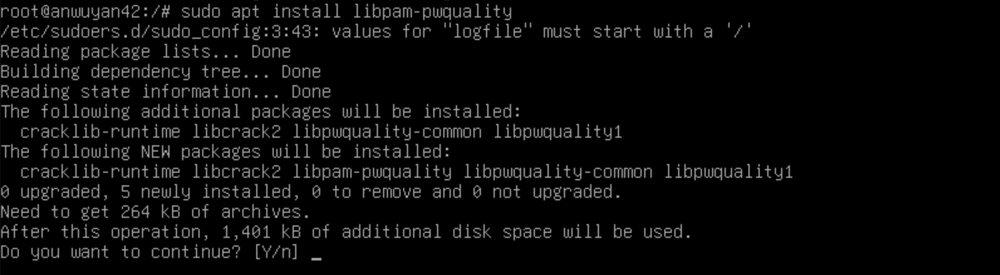


#### 103. Editing common-password Configuration File

The next step is to edit the the `/etc/pam.d/common-password` file, which is used by the Pluggable Authentication Modules (PAM) system on Linux systems. PAM provides a flexible framework for authenticating users and managing user sessions. The common-password file specifically defines the rules and policies related to password authentication.

Within this file, you can configure settings such as password complexity requirements, minimum length, and other constraints. By editing this file, you can enforce specific password policies across the system.

You can edit the the login.defs file using the following command:

```bash
sudo nano /etc/pam.d/common-password
```


After the line retry=3, we need to add the following commands:

```bash
- minlen=10 - Specifies the minimum length of the password to be 10 characters.

- ucredit=-1 -  Specifies that at least one uppercase character (u) is required.

- dcredit=-1 - Specifies that at least one digit (d) is required.

- lcredit=-1 - Specifies that at least one lowercase character (l) is required.

- maxrepeat=3 - Specifies that the same character can be repeated at most 3 times consecutively.

- reject_username - Prevents the password from containing the username.

- difok=7 - Specifies that at least 7 characters in the new password must not be present in the old password.

- enforce_for_root -  Enforces the password policy for the root user as well.
```

**It is expected to resemble this**


**QUESTION**

Should Configuration Directives in /etc/pam.d/common-password Include Spaces Between Them?

**ANSWER**

- Yes, it's generally a good practice to keep a space between each configuration directive or parameter inside the /etc/pam.d/common-password file for readability and clarity. This helps separate individual settings and makes the file easier to understand and maintain. Additionally, ensuring consistent formatting enhances the overall organization of the configuration file.


### Connecting to SSH terminal

#### 104. Setting Up SSH Access in VirtualBox

The next step in setting up SSH access typically involves configuring the virtual machine's network settings in VirtualBox. This may include tasks such as configuring port forwarding or ensuring network connectivity for the virtual machine.

Here's a breakdown of the steps:

- **Shut Down the Virtual Machine**: Close any running processes or applications within the virtual machine and then shut down the virtual machine itself.

- **Open VirtualBox and Access Settings**: Launch the VirtualBox application on your host machine and select the virtual machine you want to configure for SSH access. Then, click on the "Settings" option to access the virtual machine's settings.

- **Configure Network Settings**: Within the virtual machine's settings, navigate to the "Network" tab or section. Here, you may need to adjust the network adapter settings to enable network connectivity for the virtual machine. You might configure a bridged adapter, NAT, or host-only adapter, depending on your network setup and requirements.


- **Set Up Port Forwarding (if necessary)**: If you're using NAT or host-only networking, you may need to set up port forwarding to allow SSH connections from your host machine to the virtual machine. Configure port forwarding rules to forward connections from a specific port on your host machine to port 22 (the default SSH port) on the virtual machine.


- **Save Settings and Start the Virtual Machine**: Once you've configured the network settings and any necessary port forwarding, save the changes to the virtual machine's settings and start the virtual machine.


- **Verify Network Connectivity**: Ensure that the virtual machine has network connectivity by checking if it can access the internet or ping other devices on the network.

To verify network connectivity for the virtual machine, you can perform the following steps:

- **Ping Test**:
   - Open a terminal or command prompt on the virtual machine.
   - Use the ping command along with the IP address of a known device on the network or a public IP address, such as a website, to check connectivity. For example:
   
   ```bash
   ping 8.8.8.8
   ```
   
   - This command pings the Google Public DNS server (8.8.8.8). If successful, you should see replies from the server indicating that the network connection is working.

- **Internet Access Test**:
   - Open a web browser on the virtual machine.
   - Attempt to access a website, such as google.com or any other site of your choice. If the web page loads successfully, it confirms that the virtual machine has internet access and network connectivity.

- **Network Adapter Configuration**:
   - Check the network adapter configuration of the virtual machine in its settings. Ensure that the adapter is enabled and configured correctly to connect to the desired network (e.g., NAT, Bridged, Host-only).
   - Verify that DHCP is enabled if your network uses DHCP to assign IP addresses automatically. Alternatively, configure a static IP address if DHCP is not available.

----

❌​ REMEMBER do not use the same username for two different virtual machines. 


If not the following error message will appear:


```bash
@@@@@@@@@@@@@@@@@@@@@@@@@@@@@@@@@@@@@@@@@@@@@@@@@@@@@@@@@@@
@    WARNING: REMOTE HOST IDENTIFICATION HAS CHANGED!     @
@@@@@@@@@@@@@@@@@@@@@@@@@@@@@@@@@@@@@@@@@@@@@@@@@@@@@@@@@@@
IT IS POSSIBLE THAT SOMEONE IS DOING SOMETHING NASTY!
Someone could be eavesdropping on you right now (man-in-the-middle attack)!
It is also possible that a host key has just been changed.
The fingerprint for the ECDSA key sent by the remote host is
SHA256:S86GdRixZUqebXx5bIPJHgzHsaXz4vUhIs/hjnFc10k.
Please contact your system administrator.
Add correct host key in /Users/anwu-yan/.ssh/known_hosts to get rid of this message.
Offending ECDSA key in /Users/anwu-yan/.ssh/known_hosts:4
ECDSA host key for [localhost]:4242 has changed and you have requested strict checking.
Host key verification failed.
```

How to fix this problem 💭 :

1. Open the terminal
2. Write the following command


```bash
nano ~/.ssh/known_hosts
```

This will open a new Nano instance and display the keys within your known_hosts file. You should delete the key causing the “Warning: Remote host identification has changed” error, then save your changes.

3. You might also want to delete the entire known_hosts file, especially if you only use SSH for one or two sites. To do this, you can run the following command

```bash
rm .ssh/known_hosts in a Terminal window.
```

There’s one more method to alter the known_hosts file on Mac: using the ssh-keygen utility from the command line. This is great if you don’t want to dig into the file itself, or if you want to work with only one site or key.

To achieve this, open a Terminal window and run ssh-keygen, followed by your server hostname. For example:

```bash
ssh-keygen -R server.example.com
```


This won’t ask you if you want to delete the specified lines, so make sure you’re removing the right ones before proceeding:
Once this is done, you shouldn’t get the “Warning: Remote host identification has changed” error from there on out.

****


---


​✔️​ If the SSH connection is established successfully, you will typically see a login prompt in your terminal, indicating that you have successfully connected to the remote machine. 


Once you see the login prompt, you can proceed to enter your password or any other authentication credentials required to log in to the remote machine. Upon successful authentication, you will be granted access to the remote machine's command line interface or shell, allowing you to interact with the system as if you were physically present at the machine itself.


### Script configuration

#### 105. Script Section: Architecture

To view the architecture of the operating system along with its kernel version, you can use the uname -a command. The -a option, which is equivalent to --all, prints out comprehensive information, including the kernel name, network node hostname, kernel release, kernel version, machine hardware name, processor type, hardware platform, and operating system. This command is particularly useful for understanding the system's configuration and environment.

```bash
uname -a
```

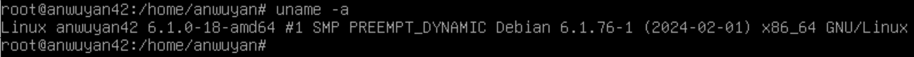

Executing this command will display detailed information about the system's architecture and kernel version. It's a quick and convenient way to gather essential details about the operating system configuration.


#### 106. Counting Physical Cores

To ascertain the number of physical cores in the system, the next step involves executing the following command:

```bash
grep "physical id" /proc/cpuinfo | wc -l 
```

This command performs the following tasks:

- **`grep "physical id" /proc/cpuinfo`**: This part of the command uses grep to search the /proc/cpuinfo file for lines containing the string "physical id". The /proc/cpuinfo file contains information about the processor(s) installed on the system.

- **`|`**: This symbol is known as a pipe and is used to redirect the output of one command as input to another command.

- **`wc -l`**: This part of the command uses wc (word count) with the -l option, which instructs wc to count the number of lines in the input it receives.

This command sifts through the /proc/cpuinfo file, which holds processor information, specifically looking for occurrences of the string "physical id". Then, by using wc -l, it tallies the number of instances found. This method ensures an accurate count of physical cores, accommodating scenarios involving multiple processors.


#### 107. Virtual Cores

To display the number of virtual cores, the approach is very similar to the one used for physical cores. We will again make use of the /proc/cpuinfo file, but this time, we will execute the following command:

```bash
grep processor /proc/cpuinfo | wc -l 
```

Here's a breakdown of how this command works:

- **`grep processor /proc/cpuinfo`**: This portion of the command searches within the /proc/cpuinfo file. The /proc/cpuinfo file contains detailed information about the CPU(s) on the system, including data on both physical and virtual cores. The grep command filters this information to only include lines that contain the word "processor". Each virtual core (or thread) on the system is listed under its own "processor" heading in this file, with a unique identifier for each one.

- **`|`**: This character is called a pipe. It takes the output from the command on its left (in this case, the filtered list of lines containing the word "processor") and passes it as input to the command on its right.

- **`wc -l`**: The wc command is short for "word count", and the -l option tells it to count the number of lines it receives as input. Since each virtual core is listed under a separate "processor" line in the /proc/cpuinfo file, counting these lines gives the total number of virtual cores in the system.


The usage is nearly identical to the previous command, except that instead of counting the lines that contain "physical id", we count the occurrences of "processor". This method is chosen because, like before, the way to quantify starts at 0 if there is one processor.


#### 108. Displaying RAM Information

**Using the free Command**:
   - The free command is utilized to display information about the memory usage on the system, including total memory, used memory, free memory, and memory used for buffers and caches.
   - For more detailed information on the free command, free --help can be executed.
   - The free --mega option is specified to display the memory information in megabytes (MB), as per the requirements mentioned in the subject. It's important to note that --mega yields measurements in megabytes, distinct from mebibytes (MiB) that would result from using -m.

**Filtering Used Memory with awk**:
   - To isolate and display only the used memory, the awk command is employed to process the output of free --mega. awk is a powerful text processing tool that can manipulate data and generate formatted reports.
   - The full command `free --mega | awk '$1 == "Mem:" {print $3}'` filters the output to print only the used memory amount. This command checks if the first word in a line is "Mem:" and then prints the third word on that line, which corresponds to the used memory.


```bash
free --mega | awk '$1 == "Mem:" {print $3}'
```

Let's break down this command to understand how it works:

- **`free --mega`**:
   - **`free`** is a command that provides information about the total amount of free and used physical and swap memory in the system, as well as the buffers and caches used by the kernel.
   - The **`--mega`** option modifies the output so that all values are displayed in megabytes (MB), making the information easier to read and understand.

- **`|`** (pipe):
   - This character is used to pass the output of the command on its left (in this case, free --mega) as input to the command on its right (here, the awk command). It's a way of chaining commands together to perform complex operations on data.

- **`awk '$1 == "Mem:" {print $3}'`**:
   - **`awk`** is a powerful text processing tool used for manipulating data and generating reports. Here, it is used to filter and process the output of the free --mega command.
   - The awk command is enclosed in single quotes, which contain instructions for awk on how to process the input it receives.
   - **`$1 == "Mem:"`** is a condition that awk checks for each line of input it processes. $1 refers to the first 'word' or field in the input line (fields are typically separated by spaces). The condition checks if the first field is exactly "Mem:", which is the line in the free command's output that contains memory usage information.
   - **`{print $3}`** is the action awk takes when the condition is met. It tells awk to print the third field of the line that matches the condition. In the context of the free --mega command's output, the third field on the "Mem:" line represents the amount of used memory (in MB).


**Displaying Total Memory**:
   - To display total memory, a similar approach is used: free --mega | awk '$1 == "Mem:" {print $2}'. This command prints the second word in the line that starts with "Mem:", representing the total memory.


```bash
free --mega | awk '$1 == "Mem:" {print $2}'
```

Here's a detailed breakdown of how this command operates:

- **`free --mega`**:
   - The free command is used to display the total amounts of free and used memory on the system, along with the buffers and cache used by the kernel.
The --mega option specifies that the output should be presented in megabytes, making it straightforward to interpret.

- **`|`** (pipe):

This symbol is used to direct the output of the preceding command (free --mega) into the following command as its input. It's a method for linking commands in a sequence for processing data.

- **`awk '$1 == "Mem:" {print $2}'`**:
   - **`awk`** is a text processing utility that manipulates data and generates reports. In this command, awk is employed to filter and process the data piped from free --mega.
   - Enclosed in single quotes are the instructions for awk. It's set to perform a specific action based on the given condition.
   - **`$1 == "Mem:"`** is the condition awk evaluates for every line it processes. $1 refers to the first 'word' or field in a line (where fields are delineated by whitespace). This condition checks if the first field matches "Mem:", identifying the line in the free command's output that contains the memory information.
   - **`{print $2}`** is the action executed by awk when the condition is true. It instructs awk to output the second field of the line matching the condition. In the output of the free --mega command, the second field on the "Mem:" line represents the total physical memory (in MB) available on the system.


**Calculating Memory Usage Percentage**:
   - For calculating and displaying the memory usage percentage with two decimal points, the command is slightly modified to include a calculation: free --mega | awk '$1 == "Mem:" {printf("(%.2f%%)\n", $3/$2*100)}'.
   - This command uses printf within awk to format the output to two decimal places (%.2f). The expression $3/$2*100 calculates the percentage of used memory over total memory. To display a percentage symbol (%), %% is used in the printf format string.


```bash
free --mega | awk '$1 == "Mem:" {printf("(%.2f%%)\n", $3/$2*100)}'
```

Let's break down this command to understand its components and functionality:

- **`free --mega`**:
   - The free command is used to display the total amounts of free and used memory on the system, along with the buffers and cache used by the kernel.
The --mega option specifies that the output should be presented in megabytes, making it straightforward to interpret.

- **`|`** (pipe):

This symbol is used to direct the output of the preceding command (free --mega) into the following command as its input. It's a method for linking commands in a sequence for processing data.

- **`awk '$1 == "Mem:" {printf("(%.2f%%)\n", $3/$2*100)}'`**:

- **`awk`** is a text processing program used to manipulate data and generate reports. In this command, awk processes the output from free --mega.
- The script within single quotes tells awk what to do with the input it receives.
- **`$1 == "Mem:"`** is a condition that checks if the first field (word or data point separated by whitespace) in a line is "Mem:". This targets the line in the free --mega output that contains the main memory (RAM) statistics.
- **`{printf("(%.2f%%)\n", $3/$2*100)}`** is the action that awk performs when the condition is met.
printf is a function that formats and prints data. "(%.2f%%)\n" is the format string:
   - **`%.2f`** formats a floating-point number to have two decimal places.
   - **`%%`** is used to print a literal percent sign.
   - **`$3/$2*100`** calculates the percentage of used memory. $3 is the third field on the "Mem:" line, representing used memory, and $2 is the second field, representing total memory. The calculation ($3/$2)*100 computes the used memory as a percentage of the total memory.
   - **`\n`**ensures that the output is followed by a new line for clean presentation.


#### 109. Memory disk

**Viewing Occupied Disk Memory**

It refers to the process of checking how much storage space is currently being used on your computer's disk drives. In the context of a Linux system, this involves examining the filesystems mounted on the system to see how much of the available storage space has been filled with data. This information is crucial for system administration and monitoring because it helps you understand how much space you have left, identify when you might need to add more storage or clean up existing files, and ensure that your system operates efficiently without running out of space unexpectedly.

```bash
df -m | grep "/dev/" | grep -v "/boot" | awk '{memory_use += $3} END {print memory_use}'
```

Let's break down this command to understand its components and functionality:

- **`df -m`**: The df (disk filesystem) command reports the system's disk space usage. The -m flag specifies that the output should be in megabytes (MB).

- **`grep "/dev/"`**: This filters the output of df -m to only include lines that contain /dev/, typically representing physical and virtual storage devices.

- **`grep -v "/boot"`**: The -v option with grep inverts the match, excluding lines that contain /boot. This removes boot-related partitions from the output, as they're not needed for this calculation.

- **`awk '{memory_use += $3} END {print memory_use}'`**: This awk command accumulates the values found in the third column ($3, which represents used space) of each line passed to it. At the end (END), it prints the total accumulated value, giving the total used disk space in MB, excluding the boot partition.


The command mentioned earlier, **`df -m | grep "/dev/" | grep -v "/boot" | awk '{memory_use += $3} END {print memory_use}'`**, specifically targets this goal by:

- Using the df command to report disk space usage of all mounted filesystems in megabytes (-m option).
- Filtering this output to only include lines representing devices (/dev/), which are typically the physical or virtual storage devices.
- Excluding lines related to the boot partition (/boot), which is usually not necessary for a general overview of occupied disk memory.
- Summing up the used space (the third column in the df output, hence $3) across these filtered lines to get a total of how much disk space is currently occupied, excluding the boot partition.


**Obtaining Total Disk Space**

It refers to the process of calculating the sum of all available disk space on a system's storage devices. This includes all partitions and drives mounted on the system, giving you a comprehensive view of the total capacity of storage that the system can use. In a computing context, total disk space is a crucial metric for system administration, capacity planning, and ensuring that adequate space is available for current and future use.


```bash
df -m | grep "/dev/" | grep -v "/boot" | awk '{use += $3; total += $2} END {printf("(%d%%)\n", use/total*100)}'
```

Let's break down this command to understand its components and functionality:

- **`df -m`**: This command displays information about disk space usage for all mounted filesystems. The -m option specifies that the output should be in megabytes (MB).
   - **`df`** stands for "disk filesystem." It reports the amount of disk space used and available on all currently mounted filesystems.
   - The **`-m`** option modifies the output to show the disk space in megabytes. 


- **`|`** (pipe): This symbol is used to direct the output of the preceding command (free --mega) into the following command as its input. It's a method for linking commands in a sequence for processing data.

- **`grep "/dev/"`**: This filters the output of df -m to only include lines that contain /dev/. This usually includes the main partitions used for storage in Linux systems, excluding special filesystems and external devices not mounted under /dev/.
   - grep is used for searching text or output. Here, it filters the output of df -m to include only lines that contain /dev/. This usually means focusing on primary storage devices, as /dev/ is the directory where device files are located.

- **`grep -v "/boot"`**: This further filters the output by excluding (-v option) lines that contain /boot. The intention here is to ignore the boot partition, as it typically does not contribute significantly to the overall storage capacity and usage being considered.
   - This uses grep again with the -v option, which inverts the search, meaning it excludes lines that contain the specified pattern.
   - "/boot" specifies the pattern to exclude. This step removes any lines related to the /boot partition from the output, as the boot partition is generally not relevant to general disk space usage assessments.

- **`awk '{use += $3; total += $2} END {printf("(%d%%)\n", use/total*100)}'`**: This is where the bulk of the processing happens, using awk, a powerful text processing tool.
   - **`awk`** is a powerful text-processing programming language. This command is used to perform calculations on the filtered output.
     
   - **`{use += $3; total += $2}`**: For each line of input, this part of the awk script adds the value in the third column to the use variable and the value in the second column to the total variable. In the context of df -m, the second column ($2) typically represents the total disk space of each partition, and the third column ($3) represents the used disk space.
     
   - **`END {printf("(%d%%)\n", use/total*100)}`**: After processing all lines of input, this part of the script executes. It calculates the percentage of disk space used by dividing the total used space (use) by the total space (total) and multiplying by 100. The printf function then formats this value as an integer percentage, followed by a percent sign, and ensures the output is followed by a newline character (\n).


#### 110. CPU usage percentage

It is a measure that indicates how much of the CPU's processing capacity is currently being used by tasks, as opposed to being idle. It provides a way to assess how heavily loaded a computer's processor is at any given time. 

The value ranges from 0% to 100%, where:

- 0% means the CPU is completely idle, not processing any tasks.
- 100% indicates the CPU is fully utilized, working at its maximum capacity on running tasks.

Understanding CPU usage is crucial for several reasons:

- **Performance Monitoring**: It helps in identifying if a CPU is being overworked, which could lead to slower performance or system responsiveness. High CPU usage over extended periods can indicate that a system might need optimization, either by terminating unnecessary processes, upgrading the CPU, or balancing the load more effectively across multiple cores or systems.

- **System Health and Efficiency**: Monitoring CPU usage can prevent overheating and potential damage to the system's hardware. It also helps in ensuring that applications and services are running efficiently.

- **Troubleshooting**: Spikes in CPU usage can help pinpoint applications or processes that are consuming excessive system resources, aiding in troubleshooting performance issues or identifying malicious software.

- **Capacity Planning**: By understanding the CPU usage patterns, IT administrators can make informed decisions about hardware upgrades, virtual machine allocations, and system scaling to meet future demands.

In a multi-core processor, CPU usage can be reported per core or as an overall average. Modern operating systems and monitoring tools provide real-time CPU usage statistics, allowing users to track this metric over time and identify trends or anomalies.


```bash
vmstat 1 4 | tail -1 | awk '{print $15}'
```

Let's break down this command to understand its components and functionality:

**`vmstat 1 4`**:

- **`vmstat`** stands for Virtual Memory Statistics. It's a utility that provides information about system processes, memory, paging, block IO, traps, disks, and CPU activity.
- The first number after vmstat, **`1`**, specifies the interval in seconds between each report.
- The second number, **`4`**, indicates the total number of updates. So, vmstat 1 4 tells vmstat to report system statistics every 1 second, a total of 4 times.

**`| tail -1`**:

- The pipe (|) passes the output of the previous command (vmstat 1 4) to the next command.
- **`tail -1`**takes the last line of output from vmstat. Since vmstat provides a series of reports (one every second for four seconds in this case), tail -1 ensures that only the most recent statistics are passed forward for further processing. This is because the initial output of vmstat includes a summary of statistics since the last reboot, followed by the interval reports, and the most current data comes from the last report generated.

**`awk '{print $15}'`**:

- **`awk`** is a text processing and pattern scanning tool. It's used here to process the single line of output forwarded by tail -1.
- **`{print $15}`** instructs awk to print the 15th field (column) of the input line it receives. In the context of vmstat output, the 15th field typically corresponds to the percentage of time the CPU was idle during the last interval reported. This means it was not running any processes and was waiting for tasks.


tail -1: This option tells tail to output the last line of the input it receives. The -1 specifies the number of lines from the end of the file (or input stream) to display, which in this case is just the very last line. This is the correct usage for wanting to process only the latest output from vmstat, for example.

tail -l: This usage is incorrect based on the conventional options available for the tail command. The tail command does not recognize -l as a valid option for specifying the number of lines to display. Typically, tail expects a number after the hyphen to indicate how many lines from the end of the file to output, such as -1, -5, -10, etc. If you intended to use -l as an option, it might be a typo or a misunderstanding of the command's options.


#### 111. Viewing the Last System Reboot Date and Time

To view the date and time of the last system reboot, you can use the who command with the -b flag. The -b flag instructs the who command to display the time of the last system boot. However, the output of who -b may include more information than desired, so further filtering is applied to extract only the relevant details. This is where the awk command comes into play.

The command structure for this operation is as follows:


```bash
who -b | awk '$1 == "system" {print $3 " " $4}'
```

Here's a breakdown of how this command works:

**`who -b`**:
- **`who`** is a command that displays information about users currently logged on to the system.
- The **`-b`** option specifically requests the display of the last system boot time, presenting the information in a format that typically includes the date and time of the last boot.

**`|`** (pipe):
- This character is used to pass the output of one command (who -b) as the input to another command (awk). It allows for sequential processing of data.

**`awk '$1 == "system" {print $3 " " $4}'`**:
- **`awk`** is a powerful text processing tool. In this command, it's used to filter and format the output received from who -b.
- The awk script checks each line of input to see if the first word ($1) is "system". If so, it indicates that the line contains the boot time information.
- **`{print $3 " " $4}`** instructs awk to print the third and fourth words from the matched line, separated by a space. In the context of the who -b output, the third word typically represents the boot date, and the fourth word represents the boot time.


The output format breaks down as follows:

- `$1`: Day of the week (Tue)
- `$2`: Month (Feb)
- `$3`: Day of the month (20)
- `$4`: Time (13:30:45)
- `$5`: Time zone (CET)
- `$6`: Year (2024)


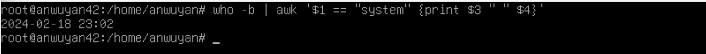


#### 112. Checking for Active LVM on the System

It checks for the presence of LVM on your system by looking for block devices that are part of an LVM volume group. It outputs "yes" if LVM volumes are found and "no" if none are detected. This can be useful for scripting, system initialization processes, or simply verifying the configuration of a system.


```bash
if [ $(lsblk | grep "lvm" | wc -l) -gt 0 ]; then echo yes; else echo no; fi
```

Here's a breakdown of how this command works:

**`lsblk`**:
- The lsblk (list block devices) command displays information about all available or specified block devices. Block devices include physical drives like HDDs, SSDs, and system memory, among others.
- This command lists devices in a tree-like format by default, showing how they're partitioned or combined (in the case of LVM).

**`grep "lvm"`**:
- This filters the output of lsblk to only include lines containing the string "lvm".
- When LVM is used, logical volumes are marked with "lvm" in the TYPE column of the lsblk output. This step aims to isolate those lines to determine if any LVM volumes are present.

**`wc -l`**:
- This counts the number of lines passed to it, which, after grep, would be the number of devices managed by LVM.
- The result is a numerical value representing how many block devices (if any) are using LVM on the system.

**`if [ $(...) -gt 0 ]; then echo yes; else echo no; fi`:**
- This is a conditional (if-else) statement in bash scripting.
- [ $(...) -gt 0 ]: Checks if the output of the command enclosed in $(...) (the count of lines containing "lvm") is greater than 0.
- If true (-gt stands for "greater than"), it indicates that there is at least one LVM volume present, and the script echoes "yes".
- If false, meaning the count is 0, no LVM volumes are detected, and the script echoes "no".


#### 113. Counting Established TCP Connections

To check the number of established TCP (Transmission Control Protocol) connections on a system, the command ss -ta | grep ESTAB | wc -l is used. This command sequence is a modern and efficient way to inspect network connections, leveraging the ss utility, which has largely replaced the older netstat tool for many system and network administrators due to its more extensive capabilities and faster performance. 


```bash
ss -ta | grep ESTAB | wc -l
```


Here's a breakdown of the command:

**`ss -ta`**:
- ss stands for "socket statistics". It is a utility for inspecting sockets on a Linux system.
- The **`-t`** option tells ss to only display TCP sockets.
- The **`-a`** option instructs ss to show all sockets, including both listening and non-listening (i.e., established) TCP connections.

**`| grep ESTAB`**:
- This part of the command pipes (|) the output of ss -ta into grep, which is used to filter text or output based on specific patterns.
grep ESTAB filters the list of TCP sockets to only include those that are in the "ESTABLISHED" state, meaning there is an active, open connection between two endpoints.

**`wc -l`**:
- This command counts the number of lines in the input it receives, which, after the filtering done by grep, corresponds to the number of established TCP connections.
- **`wc`** stands for "word count"
- **`-l`** option specifies that it should count lines


#### 114. Counting Current User Sessions

To calculate the number of user sessions currently active on a system, the command users | wc -w is used. This approach is simple yet effective for obtaining a quick overview of system activity from a user perspective. Here's how the command works:


```bash
users | wc -w 
```

**`users`**:
- The users command displays the names of users currently logged into the system. The output is a space-separated list where each username represents an active session. If a user is logged in more than once, their name appears in this list for each session.

**`| (pipe)`**:
- This symbol is used to pass the output of the users command forward as input to another command. It allows for the sequential processing of data using multiple command-line tools.

**`wc -w`**:
- The **`wc`** (word count) command, when used with the -w option, counts the number of words in the input it receives. In this context, each username (or word) from the users command's output is counted.
- Since wc -w counts every word in the input, the total number reflects the number of user sessions, not necessarily the number of unique users. This means if a user is logged into multiple sessions, they will be counted multiple times.


#### 115. Obtaining the IP Address

Obtaining the IP address of a computer is a fundamental task in networking that involves identifying the network address assigned to a device. This address is crucial for enabling communication between devices on a network and across the internet. The process to retrieve the IP address varies slightly depending on the operating system, but on Unix-like systems, a common and straightforward method involves using the hostname command with specific options. Here's how it works:


```bash
hostname -I
```

The hostname command, when used with the -I option, displays all network addresses (IP addresses) associated with the host. This can include both IPv4 and IPv6 addresses. It provides a simple way to quickly identify the machine's IP addresses without delving into specific network interfaces.


#### 116. Obtaining the MAC Address

A MAC (Media Access Control) address is a unique identifier assigned to network interfaces for communications on the physical network segment. MAC addresses are used as a network address for most IEEE 802 network technologies, including Ethernet and Wi-Fi. Unlike IP addresses which can change depending on the network connected to, the MAC address is a fixed attribute of the network interface controller (NIC) and is unique to it.

To obtain the MAC address of network interfaces on a Unix-like operating system, the command ip link combined with text processing tools like grep and awk can be used. 

```bash
ip link | grep "link/ether" | awk '{print $2}'
```

Here’s how the process works:

 - **`ip link`**: This command is used to display information about all the network interfaces on the system. The output includes various details about each interface, such as its state (up/down), MAC address, and more. The ip command is part of the iproute2 package available on most Linux distributions and has largely replaced the older ifconfig command.

 - **`grep "link/ether"`**:  The output of ip link is then piped to grep, which filters the output to only include lines containing "link/ether". This part specifically targets the lines that display the MAC addresses of the interfaces, as "link/ether" is the indicator of an Ethernet link layer and its associated MAC address.

 -**`awk '{print $2}'`**:Finally, awk is used to extract and print only the second field of the filtered lines, which corresponds to the MAC address itself. awk is a powerful text processing tool, and in this context, it's used to neatly isolate the MAC address from the rest of the information.


#### 117. Counting Commands Executed with Sudo

To determine the number of commands that have been executed using sudo on a Unix-like system, the journalctl command is utilized in conjunction with other command-line tools. journalctl is a utility for querying and displaying messages from the systemd journal, which is used for system logging and includes records of all sudo command executions among other system events. 

```bash
journalctl _COMM=sudo | grep COMMAND | wc -l
```

Here's how the process works:

- **`journalctl _COMM=sudo`**: This command uses journalctl to query the systemd journal for entries related to sudo. The _COMM=sudo part specifies that the command should filter entries where the executable command name (_COMM) is sudo. This effectively selects log entries generated by the sudo command, which is responsible for granting elevated privileges for command execution.

- **`grep COMMAND`**: The output from journalctl is then piped to grep, which further filters the entries to only include those containing the word "COMMAND". This is because each use of sudo to execute a command is logged with "COMMAND" in the journal entry, distinguishing actual command executions from other sudo-related log entries, such as session initiations or terminations.

- **`wc -l`**: Finally, the output from grep is piped to wc -l, which counts the number of lines in the input it receives. Since each line at this stage represents a sudo command execution, this count reflects the total number of commands executed with sudo.


**Usage**

- This command sequence is a powerful way to audit or monitor the use of sudo on a system, providing a count of how many times commands have been executed with elevated privileges. It can be particularly useful for system administrators for security auditing, tracking system changes, or identifying potential misuse of sudo.

**Verification**

- To verify its functionality, you can execute a command using sudo, then rerun the journalctl _COMM=sudo | grep COMMAND | wc -l command. The count should increase by one, reflecting the newly executed sudo command.


#### 118. Total Script Execution Result


```bash
#!/bin/bash

# ARCH
arch=$(uname -a)

# CPU PHYSICAL
cpuf=$(grep "physical id" /proc/cpuinfo | wc -l)

# CPU VIRTUAL
cpuv=$(grep "processor" /proc/cpuinfo | wc -l)

# RAM
ram_total=$(free --mega | awk '$1 == "Mem:" {printf $2}')
ram_use=$(free --mega | awk '$1 == "Mem:" {printf $3}')
ram_percent=$(free --mega | awk '$1 == "Mem:" {printf("%.2f%%"), $3/$2*100}')

# DISK
disk_total=$(df -m | grep "/dev/" | grep -v "/boot" | awk '{disk_t += $2} END {printf ("%.1fGb\n"), disk_t/1024}')
disk_use=$(df -m | grep "/dev/" | grep -v "/boot" | awk '{disk_u += $3} END {printf ("%.1fGb\n"), disk_u/1024}')
disk_percent=$(df -m | grep "/dev/" | grep -v "/boot" | awk '{disk_u += $3} {disk_t+= $2} END {printf("%.1f"), disk_u/disk_t*100}')

# CPU LOAD
cpul=$(vmstat 1 2 | tail -1 | awk '{printf $15}')
cpu_op=$(echo "100 - $cpul")
cpu_fin=$(printf "%.1f" $cpu_op)

# LAST BOOT
lb=$(who -b | awk '$1 == "system" {print $3 " " $4}')

# LVM USE
lvmu=$(if [ $(lsblk | grep "lvm" | wc -l) -gt 0 ]; then echo yes; else echo no; fi)

# TCP CONNEXIONS
tcpc=$(ss -ta | grep ESTAB | wc -l)

# USER LOG
ulog=$(users | wc -w)

# NETWORK
ip=$(hostname -I)
mac=$(ip link | grep "link/ether" | awk '{print $2}')

# SUDO
cmnd=$(journalctl _COMM=sudo | grep COMMAND | wc -l)

wall "	Architecture: $arch
	CPU physical: $cpuf
	vCPU: $cpuv
	Memory Usage: $ram_use/${ram_total}MB ($ram_percent%)
	Disk Usage: $disk_use/${disk_total} ($disk_percent%)
	CPU load: $cpu_fin%
	Last boot: $lb
	LVM use: $lvmu
	Connections TCP: $tcpc ESTABLISHED
	User log: $ulog
	Network: IP $ip ($mac)
	Sudo: $cmnd cmd"
```

When you execute sh monitoring.sh, here's what happens step by step:

- **Architecture ($arch)**: Displays the system architecture information using uname -a.
- **Physical CPUs ($cpuf)**: Counts the number of physical CPUs using grep on /proc/cpuinfo.
- **Virtual CPUs ($cpuv)**: Counts the number of virtual CPUs (cores) similarly.
- **RAM Usage ($ram_total, $ram_use, $ram_percent)**: Calculates total, used, and percentage of RAM usage.
- **Disk Usage ($disk_total, $disk_use, $disk_percent)**: Computes total, used, and percentage of disk usage, excluding the boot partition.
- **CPU Load ($cpu_fin)**: Determines the CPU load as a percentage of utilization.
- **Last Boot ($lb)**: Fetches the last system boot time.
- **LVM Use ($lvmu)**: Checks if LVM is in use on any of the block devices.
- **TCP Connections ($tcpc)**: Counts established TCP connections.
- **User Log ($ulog)**: Counts the number of user sessions.
- **Network ($ip and $mac)**: Retrieves the IP and MAC addresses.
- **Sudo Commands ($cmnd)**: Counts the number of commands executed with sudo.


Common Issues and Solutions:

- **Unexpected Argument -99**: This error message suggests there's an issue with how numbers are processed or calculated, particularly with the CPU load calculation. The use of expr for arithmetic operations, especially when dealing with non-integer values or expecting a negative sign as part of the calculation, can cause errors. Ensure that all variables are correctly calculated and formatted before they are used in arithmetic expressions or passed to other commands.

- **Floating Point Arithmetic in Bash**: Bash does not natively support floating-point arithmetic, which can be problematic for calculations expecting decimal results. Use bc or awk for calculations that may involve floating points.

- **Correct Execution**: To execute the script, you typically would use bash monitoring.sh or sh monitoring.sh, depending on the shell compatibility. Ensure the script has executable permissions (chmod +x monitoring.sh) and that you're invoking it from a shell that supports its syntax and commands.

- **Permissions and Access**: Some commands within the script might require higher privileges. Ensure you have the necessary permissions to execute all parts of the script, especially for accessing logs with journalctl or modifying network settings.


---

More detailed explanation (If you wish, skip this part, up to you !)

**1. Architecture (arch)**
- Command: arch=$(uname -a)
- Explanation: Retrieves comprehensive system information including the kernel name, hostname, kernel release, machine hardware name, and more. Stored in the arch variable, it's used to show the system's architecture.
- Significance: Useful for understanding the system's hardware and software environment.

**2. CPU Physical (cpuf)**
- Command: cpuf=$(grep "physical id" /proc/cpuinfo | wc -l)
- Explanation: Counts the number of physical CPU cores by looking for unique "physical id" entries in /proc/cpuinfo. This value is stored in the cpuf variable.
- Significance: Indicates the physical CPU count, important for assessing the hardware capacity.

**3. CPU Virtual (cpuv)**
- Command: cpuv=$(grep "processor" /proc/cpuinfo | wc -l)
- Explanation: Counts the number of virtual processors (or threads) available on the system. This is typically higher than the physical count in multi-threaded CPUs.
- Significance: Reflects the concurrency level the system can handle, affecting performance.

**4. RAM Usage**
- Commands:
    - Total: ram_total=$(free --mega | awk '$1 == "Mem:" {printf $2}')
    - Used: ram_use=$(free --mega | awk '$1 == "Mem:" {printf $3}')
- Percentage: ram_percent=$(free --mega | awk '$1 == "Mem:" {printf("%.2f%%"), $3/$2*100}')
- Explanation: Uses free to fetch memory usage in megabytes, parsing total, used, and calculating the percentage of used memory.
- Significance: Shows how much memory is being utilized, critical for performance monitoring.

**5. Disk Usage**
Commands:
- Total: disk_total=$(df -m | awk '{disk_t += $2} END {printf ("%.1fGb\n"), disk_t/1024}')
- Used: disk_use=$(df -m | awk '{disk_u += $3} END {printf ("%.1fGb\n"), disk_u/1024}')
- Percentage: disk_percent=$(df -m | awk '{disk_u += $3} {disk_t+= $2} END {printf("%.1f"), disk_u/disk_t*100}')
- Explanation: Summarizes disk usage by calculating total and used space in gigabytes, along with the usage percentage.
- Significance: Essential for managing storage resources and planning for capacity.

**6. CPU Load (cpu_fin)**
- Command: cpu_fin=$(vmstat 1 2 | tail -1 | awk '{printf "%.1f", 100 - $15}')
- Explanation: Uses vmstat to get system statistics, then calculates CPU load by subtracting the idle time from 100%.
- Significance: Indicates the current workload on the CPU, with higher values suggesting more activity.

**7. Last Boot (lb)**
Command: lb=$(who -b | awk '$1 == "system" {print $3 " " $4}')
Explanation: Extracts the last system boot time from the who command output.
Significance: Useful for tracking system uptime and maintenance windows.

**8. LVM Use (lvmu)**
Command: lvmu=$(lsblk | grep "lvm" | wc -l > 0 && echo yes || echo no)
Explanation: Checks if any block devices use LVM. Outputs "yes" if LVM is found, "no" otherwise.
Significance: Indicates whether the Logical Volume Manager is in use, affecting disk management strategies.

**9. TCP Connections (tcpc)**
Command: tcpc=$(ss -ta | grep ESTAB | wc -l)
Explanation: Counts established TCP connections by filtering the ss command output.
Significance: Reflects the system's network activity level and potential load.

**10. User Log (ulog)**
Command: ulog=$(users | wc -w)
Explanation: Counts the number of user sessions by listing logged-in users and counting the words.
Significance: Shows how many user sessions are active, useful for assessing system access.

**11. Network (ip and mac)**
Commands:
IP: ip=$(hostname -I)
MAC: mac=$(ip link | grep "link/ether" | awk '{print $2}')
Explanation: Retrieves the system's IP addresses and the MAC addresses of network interfaces.
Significance: Provides network identity information, critical for networking and security purposes.

**12. Sudo Commands (cmnd)**
Command: cmnd=$(journalctl _COMM=sudo | grep COMMAND | wc -l)
Explanation: Counts the number of commands executed with sudo privileges by querying the system journal.
Significance: Indicates the frequency of elevated command executions, relevant for security and auditing.


**`grep`**
Explanation: grep is a command-line utility for searching plain-text data sets for lines that match a regular expression. It's widely used to filter and search for specific patterns within files or command output.
Significance: Essential for parsing logs, files, or command output to find specific information, such as looking for "processor" entries in /proc/cpuinfo.

**`awk`**
Explanation: awk is a programming language designed for text processing and typically used as a command-line tool. It's powerful for pattern scanning and processing, often used for data extraction and reporting.
Significance: In scripts, it's used for complex parsing tasks, calculations, and formatting output, such as calculating used memory percentage or formatting disk space usage.

**`cmnd`**
- Explanation: In the context of your script, cmnd is a variable that typically stores the result of a command. Here, it might be used to hold the count of commands executed with sudo, as extracted from the system's journal.
- Significance: It's significant for auditing and monitoring system security by tracking the use of elevated privileges.

**`disk_u` and `disk_t`**
- Explanation: These are variables used within an awk script to accumulate total and used disk space, respectively. disk_u for used disk space, and disk_t for total disk space.
- Significance: They enable calculating the overall disk usage percentage by keeping a running total of disk space metrics.

**`--mega**
- Explanation: This is an option used with the free command to display memory information in megabytes. It standardizes the output for easier reading and processing.
- Significance: Facilitates consistent memory usage reports across various systems, aiding in monitoring and comparison tasks.

**`printf` vs. `print`**

- Explanation: In the context of awk, printf is used for formatted output, allowing the specification of output formats (like %d for integers, %.2f for floating-point numbers with two decimals), while print outputs data directly without formatting.
- Significance: printf is crucial for generating readable and well-formatted reports from command-line processing, especially when precise formatting of numbers and text is required.

**`/proc`**
- Explanation: /proc is a virtual filesystem in Unix-like operating systems that provides a mechanism for kernel-space to send information to user-space. It contains runtime system information (e.g., system memory, devices mounted, hardware configuration, etc.).
- Significance: It's a direct interface to gather dynamic system information, such as CPU or memory details, without needing to probe hardware directly.

**`%.1fGb\n`**
- Explanation: This format specifier in printf commands indicates formatting a floating-point number to one decimal place followed by "Gb", and then a newline character (\n).
- Significance: Ensures consistent and human-readable formatting for displaying disk space or memory usage in gigabytes.

**`$ Next to a Number`**
- Explanation: When $ precedes a number in the context of commands like awk, it refers to the specific field or column number of the input. For example, $2 refers to the second field.
- Significance: Allows selective processing of input data based on its structure, enabling targeted manipulation and reporting of specific data points.


**`ulog`**
The ulog variable stands for "User Logins" or "User Log Count".


**`cpuf`**
It stands for "CPU Physical" or "Physical CPU Count".


---

### Crontab configuration

#### 119. Understanding and Configuring Crontab for Scheduled Tasks

Crontab, short for "cron table," is a feature in Unix-like operating systems that allows users to schedule tasks to be executed automatically at specified times or intervals. It works with the cron daemon, a background service that checks the crontab file for tasks and runs them at the scheduled times. 

Here's a breakdown of how crontab works and how to use it:


**Key Components**:
- Cron Daemon: The background service that executes scheduled tasks.
- Crontab File: A file where users list commands and the times at which they should be executed.

**Configuring Crontab**:
- Editing the Crontab File:
   - To edit or create your crontab file, you use the command **`crontab -e`**. This command opens your crontab file in the default text editor.
   - For editing the crontab file for the root user, you might use sudo **`crontab -u root -e`**, which allows scheduling tasks with root privileges.

- Scheduling Format:
   - The crontab file consists of lines of text, each representing a separate job. Each line is structured in a specific format: minute hour day month day-of-week command.
   - For example, to schedule a script to run every 10 minutes, you'd write: ***`/10 * * * * sh /path/to/script`**. This breaks down as follows:
	- **`/10`**: At every 10th minute.
 	- **`*`**: Every hour.
	- **`*`**: Every day of the month.
	- **`*`**: Every month.
   	- **`*`**: Every day of the week.
   	- **`sh /path/to/script`**: The command to run, in this case, executing a shell script.

**Uses and Applications**:
- **Automated Backups**: Schedule regular backups of important data.
- **System Maintenance**: Run cleanup scripts to free disk space or update software.
- **Task Automation**: Automatically run scripts for data processing, sending emails, or other repetitive tasks.

**Advantages**:
- **Efficiency**: Automates repetitive tasks, saving time and reducing the likelihood of human error.
- **Flexibility**: Offers precise control over when tasks are executed, supporting complex scheduling needs.
- **Reliability**: Once configured, tasks will continue to run at scheduled intervals without further intervention.


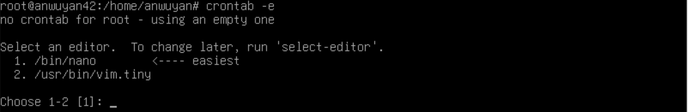


---


## Part 3️⃣: Advanced System Configuration and Web Services

In this segment, we delve into advanced system configuration, starting with the setup of a WordPress site powered by lighttpd, MariaDB, and PHP. This process is meticulously guided to ensure a smooth and functional setup. Beyond the WordPress installation, participants are encouraged to select and implement an additional service of their choosing, with the rationale for this choice being its utility and contribution to the system's overall functionality. A significant focus is placed on security measures and performance tuning, aiming to craft a system that is not only secure but also operates efficiently.

### Lighttpd


#### 120. Package Installation


This command installs the lighttpd web server on your system, making it capable of serving web pages.

```bash
sudo apt install lighttpd
```


#### 121. Allowing Connections Through Port 80

This step involves opening port 80 on your firewall with the following command:

```bash
sudo ufw allow 80
```

This command configures the firewall to allow incoming connections on port 80, which is the default port used by web servers to serve HTTP traffic.


#### 122. Verifying Port 80 is Allowed

After allowing connections through port 80, it's important to check that the rule has been successfully applied with the following command:

```bash
sudo ufw status
```

You should see port 80 listed as allowed in your firewall's configuration. This verification ensures that your web server can receive incoming connections on port 80 without being blocked by the firewall.


#### 123. Adding a Rule for Port 80

The next step is to add a specific rule that includes port 80 in your port forwarding configuration. If you're unsure how to add rules for port forwarding, you can refer to the instructions provided in your virtual machine or router's documentation. This typically involves going to the machine's network settings, finding the port forwarding section, and replicating the settings as shown in an example or screenshot provided.


### WordPress

WordPress is a free and open-source content management system (CMS) written in PHP and paired with a MySQL or MariaDB database. It's one of the most popular and flexible platforms for creating websites, blogs, and a wide range of digital experiences. WordPress makes it easy for users without coding expertise to build and manage their own sites thanks to its user-friendly interface, extensive plugin architecture, and themes that allow customization of the site's appearance and functionality. Whether for personal blogs, business websites, or complex portals, WordPress provides tools that cater to users' needs, from publishing content to user management, making it a go-to solution for web development.


#### 124. Installing wget and zip

This step involves installing wget and zip on your system using the following command:

```bash
sudo apt install wget zip
```


wget is used for downloading files from the internet, and zip is for handling zip archives. This preparation is crucial for obtaining and unpacking the latest version of WordPress.


#### 125. Navigating to the /var/www/ Directory


After installing the necessary packages, you move to the /var/www/ directory with the following command:

```bash
cd /var/www/
```

This directory is typically used to store web content on a Linux server.


#### 126. Downloading the Latest Version of WordPress

Inside the /var/www/ directory, you download the latest Spanish version of WordPress using the following command:

Spanish version

```bash
sudo wget https://es.wordpress.org/latest-es_ES.zip 
```

English version

```bash
sudo wget https://wordpress.org/latest.zip
```


Choosing the preferred language for your WordPress installation allows you to tailor the website experience to your or your audience's linguistic preferences. 

#### 127. Extracting the WordPress Archive

You then extract the downloaded WordPress archive with the following command:

```bash
sudo unzip latest-es_ES.zip
```

Spanish version

```bash
sudo unzip latest-es_ES.zip
```

English version

```bash
sudo unzip latest.zip
```


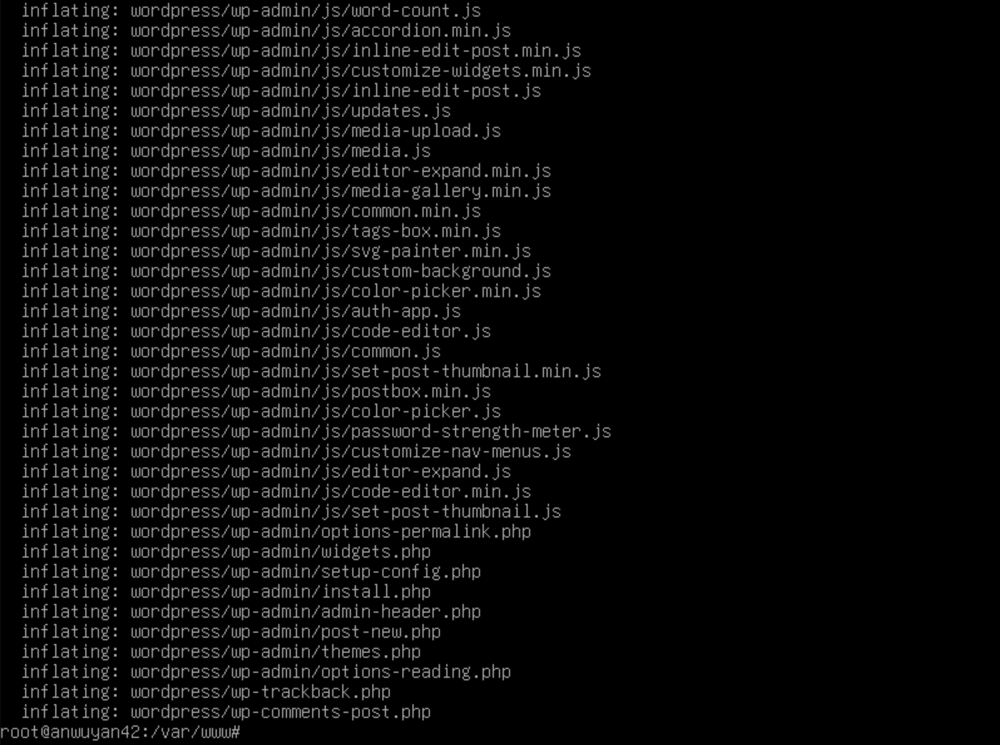

This step unpacks the WordPress files, preparing them for the installation process.

#### 128. Renaming the html Directory

Before setting up WordPress, the existing html directory is renamed to html_old using the following command:

```bash
sudo mv html/ html_old/
```

This is done to preserve any existing content in the html directory while making space for WordPress.

#### 129. Renaming the WordPress Directory

The extracted wordpress directory is renamed to html using the following command:

```bash
sudo mv wordpress/ html/
```

This effectively makes WordPress the root web content, accessible directly via your server's domain or IP address.

#### 130. Setting Permissions for the html Directory

Finally, permissions for the html directory are set to 755 with the following command:

```bash
sudo chmod -R 755 html/
```

This permission setting allows the owner full read, write, and execute permissions, while the group and others can only read and execute. This step ensures the correct access rights for the WordPress files.


### Mariadb

MariaDB is an open-source relational database management system (RDBMS), which is a fork of MySQL. It was created by the original developers of MySQL after concerns over its acquisition by Oracle Corporation. MariaDB is designed to be highly compatible with MySQL, meaning it intends to maintain compatibility with MySQL databases and can generally be used as a drop-in replacement.

**Key Features of MariaDB:**

- **Compatibility with MySQL**: MariaDB is designed to be binary compatible with MySQL databases, which means that data and table definition files are interchangeable, and it supports all MySQL connectors and APIs.

- **Open Source**: MariaDB is developed as open-source software under the GNU General Public License. This ensures that it remains free to use, modify, and distribute.

- **Performance Improvements**: MariaDB includes several storage engines and optimizations that can lead to improved performance over MySQL for many scenarios.

- **Advanced Features**: Beyond MySQL's features, MariaDB has introduced new features like the Aria storage engine for better caching and performance, Galera cluster technology for synchronous multi-master replication, and more.

- **Security**: MariaDB comes with robust security features. It offers frequent security updates and enhancements to ensure data protection.

- **Community-Driven Development**: MariaDB is developed with the participation of the community, which contributes to its features, stability, and security. The MariaDB Foundation oversees its development, ensuring that it remains open and accessible.

**Use Cases:**

- **Web Applications**: MariaDB is widely used as the database server for PHP-based web applications, including WordPress, Drupal, and Joomla.

- **Enterprise Solutions**: Its scalability and reliability make MariaDB suitable for enterprise-level applications, offering solutions for data warehousing, e-commerce, and more.

- **Cloud Computing**: MariaDB is also used in cloud environments, providing the database services for cloud applications and services.


#### 131. Installing MariaDB Server Packages

This step involves installing the MariaDB server on your system using the following command:

```bash
apt install mariadb-server
```
MariaDB is a popular open-source database management system and a drop-in replacement for MySQL.


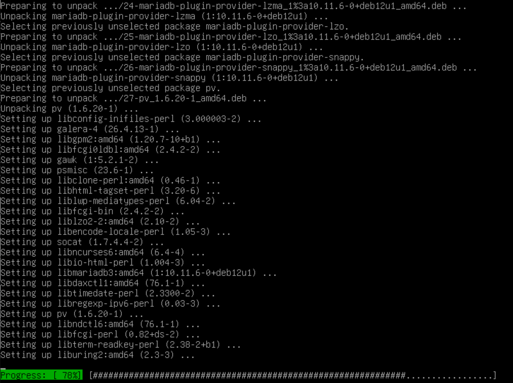

#### 132. Securing MariaDB Installation

After installation, MariaDB's default configuration is not secure. To enhance security, you execute the following command:


```bash
sudo mysql_secure_installation
```

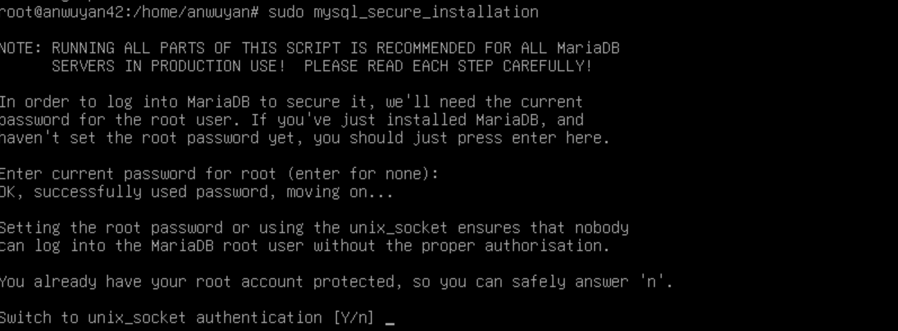

```bash
Switch to unix_socket autentication? → N
Change the root password? → N
Remove anonymous users? → Y
Disallow root login remotely? → Y
Remove test database and acces to it? → Y
Reaload privilege tables now? → Y
```


#### 133. Accessing MariaDB

The next step is to access MariaDB to begin database and user configuration. This is done using the following command:

```bash
Mariadb
```


#### 134. Creating a WordPress Database

Here, you create a database specifically for WordPress, named wp_database in this case, using the following command:

```bash
CREATE DATABASE wp_database;
```

This database will store all WordPress-related data.


#### 135. Verifying the Database Creation

To ensure the WordPress database has been created successfully, you can list all databases with the followin command:

```bash
SHOW DATABASES;
```

This allows you to confirm the presence of wp_database among the listed databases.


#### 136.Creating a Database User

Next, you create a new user within MariaDB for WordPress using the following command:


```bash
CREATE USER 'anwuyan-'@'localhost' IDENTIFIED BY '12345';
```

This user (anwuyan-) will be used to manage the WordPress database, ensuring operations are performed under a specific user account rather than using the root account.


**🆕​ LOCAL HOST**

What is localhost?
Localhost refers to the local computer you're currently using. When you navigate to localhost in your web browser, you're accessing a web server software (like OpenLiteSpeed) running on your own machine, not on the internet. It's a way to test web applications locally before deploying them to a live environment.


#### 137. Granting Privileges to the New User

You then grant all necessary privileges to the newly created user for managing the WordPress database with the following command:

```bash
GRANT ALL PRIVILEGES ON wp_database.* TO 'yourusername'@'localhost';
```

This step is crucial for allowing the user full access to the database for all operations required by WordPress.


#### 138. Flushing Privileges

After granting privileges, you need to apply the changes with the following command:


```bash
FLUSH PRIVILEGES;
```

This command updates the system's privilege tables, making the new permissions effective immediately.


#### 139. Exiting MariaDB

Finally, once all the previous steps are completed, you exit with the following command:

```bash
MariaDB 
```

This concludes the database setup process for WordPress.


### PHP

#### 140. Installing PHP Packages

It is the process of adding specific PHP-related software packages to a system. This step is crucial in preparing a server to serve dynamic content, specifically content that is generated through PHP scripts and that interacts with MySQL databases. These packages are foundational for a wide range of web applications, enabling them to run efficiently on a server and interact with database systems to manage data.


```bash
sudo apt install php-cgi php-mysql
```

Here's a breakdown of the command and its components:


- **`sudo`**: This is a command-line program that allows users to run programs with the security privileges of another user, by default the superuser or root. It stands for "superuser do." Using sudo ensures that the command that follows is executed with administrative privileges, which are typically required for installing software on Linux systems.

- **`apt`**: Short for **"Advanced Package Tool"**, it is a command-line tool used in Debian and Ubuntu-based Linux distributions for handling packages. apt simplifies the process of managing software by automating the retrieval, configuration, and installation of software packages.

- **`install`**: This is an argument to the apt command that instructs it to install the specified software packages.

- **`php-cgi`**: This package is necessary for running PHP scripts using the **CGI (Common Gateway Interface)** method. CGI is a standard way for web servers to interface with executable programs installed on a server that generate web pages dynamically. While not the only way to run PHP applications, it's one of the methods used especially in certain configurations or with specific web servers.

- **`php-mysql`**: This package is a PHP extension that allows PHP code to connect to MySQL databases. It provides the necessary functions to communicate with MySQL databases, including operations like connecting to a database, querying the database, and managing retrieved data. This is essential for web applications that need to store or retrieve data from a MySQL database.


### WordPress Configuration

#### 141. Accessing the Web Directory

We navigate to the /var/www/html directory using the command: 

```bash
cd /var/www/html
```

This is typically the root directory for web content on a Linux server.


 #### 142. Copying the WordPress Configuration File

We copy the wp-config-sample.php file and rename it to wp-config.php with the following command:

```bash
cp wp-config-sample.php wp-config.php
```

This is a crucial step in setting up WordPress, as the wp-config.php file contains the WordPress database settings.


#### 143. Editing the WordPress Configuration


After renaming the file, we edit wp-config.php using the following command:

```bash
nano wp-config.php
```

and modify the specified values. These are:


```bash
- define( 'DB_NAME','**database_name_here'**):  Remember the step 134. Creating a WordPress Database

Modify database_name_here to wp_database


- define( 'DB_NAME',**'username_here'**):  Remember the step 134. Creating a WordPress Database

Modify username_here to anwuyan-


- define( 'DB_NAME',**'password_here'**): Remember the step136. Creating a Database User

Modify password_here to 12345

```


These changes are necessary to connect WordPress to the previously created database and its user, ensuring WordPress can interact with the database.


#### 144. Enabling the FastCGI Module in Lighttpd
We enable the fastcgi module in Lighttpd to enhance the performance and speed of web applications on the server with the the following command:


```bash
sudo lighty-enable-mod fastcgi
```

FastCGI is a protocol for interfacing interactive programs with a web server, improving the speed and efficiency of PHP applications.


#### 145. Enabling the FastCGI-PHP Module in Lighttpd
Similar to step 144, we enable the fastcgi-php module in Lighttpd to boost the performance and speed of PHP-based web applications on the server using the following command: 

```bash
sudo lighty-enable-mod fastcgi-php.
```

This step further optimizes PHP processing on Lighttpd.


#### 146. Applying Configuration Changes

We update and apply the changes to the server's configuration with the following command: 


```bash
sudo service lighttpd force-reload
```

This command reloads the Lighttpd server, applying all the changes made, including the enabled modules and any other configuration adjustments.


---

ERROR 1

**Troubleshooting WordPress: Resolving 'Error Establishing a Database Connection**

When you enter "localhost" in your browser to access WordPress and encounter the error message "Error establishing a database connection," it indicates a problem with the connection between your WordPress site and its database. This error can be due to various issues, such as incorrect database settings, database server downtime, or insufficient user permissions. To troubleshoot and fix the issue, follow these steps:

1. Check the WordPress Database Configuration: Verify that your WordPress configuration file (wp-config.php), located in the root directory of your WordPress installation (commonly /var/www/html), contains the correct database information. Use the following command to open the wp-config.php file in a text editor (e.g., nano) if you're accessing your server via SSH:


```bash
sudo nano /var/www/html/wp-config.php
```


Ensure the following lines match your actual database name, user, password, and host:


```bash
define('DB_NAME', 'your_database_name');
define('DB_USER', 'your_database_user');
define('DB_PASSWORD', 'your_database_password');
define('DB_HOST', 'localhost');
```

Replace the placeholders with your actual database details.

2. Verify the Database Server is Running: Check if your database server (MySQL or MariaDB) is operational.


Use the following command for systems using systemd:

```bash
sudo systemctl status mysql
```

Or for MariaDB:

```bash
sudo systemctl status mariadb
```


If the service isn't running, start it using:

```bash
sudo systemctl start mysql
```

Or for MariaDB:

```bash
sudo systemctl start mariadb
```

3. Check Database User Permissions: Ensure the database user specified in wp-config.php has the necessary permissions to access and modify the database. Grant permissions using:


```bash
GRANT ALL PRIVILEGES ON your_database_name.* TO 'your_database_user'@'localhost';
FLUSH PRIVILEGES;
```

Replace your_database_name and your_database_user with your actual details.

To verify and grant user permissions, and to troubleshoot user existence and privileges, follow these steps:

- Verify User Permissions: Check if the user anwuyan- has necessary permissions for wp_database by logging into MySQL/MariaDB and running:

```bash
SHOW GRANTS FOR 'anwuyan-'@'localhost';
FLUSH PRIVILEGES;
```

Grant required permissions if needed:

```bash
GRANT ALL PRIVILEGES ON wp_database.* TO 'anwuyan-'@'localhost';
FLUSH PRIVILEGES;
```

- Test Database Connection: Connect to the database using the command line to ensure the credentials work:

```bash
mysql -u anwuyan- -p wp_database
```

- Check If the User Already Exists: Log into MySQL/MariaDB and list all users to check for the existence of anwuyan-. If necessary, drop and recreate the user with correct permissions and password.

After completing these steps, double-check your wp-config.php settings, ensure the database server is running, and test your WordPress site again by navigating to http://localhost. If the issue persists, review both MySQL/MariaDB and your web server's error logs for further troubleshooting.


ERROR 2

##### MySQL/MariaDB Error: Creating User

Error Explanation:
ERROR 1396 (HY000): Operation CREATE USER failed for 'anwuyan-'@'localhost' indicates a problem creating the MySQL/MariaDB user anwuyan- at localhost. 

This error can occur if:
- The User Already Exists: Trying to create a user that already exists in the database system.
- The Username Is Invalid: The username format might not be accepted by MySQL/MariaDB, though anwuyan- seems a valid name, assuming hyphens are allowed.
- Insufficient Privileges: The account you're using to execute the CREATE USER command might not have sufficient privileges to create new users.

How to Fix:
- Check for Existing User: Use SELECT user, host FROM mysql.user; to see if anwuyan- already exists. If it does and you want to reset it, use DROP USER 'anwuyan-'@'localhost'; followed by CREATE USER again.
- Ensure Valid Username: Verify that the username anwuyan- adheres to MySQL/MariaDB naming conventions (which it should).
- Check Privileges: Make sure you're logged in as a root user or a user with the CREATE USER privilege. If not, log in with a user that has these privileges or ask your database administrator for assistance.

##### Locale Setting Warnings
LANGUAGE = "en_GB:en",
	LC_ALL = (unset),
	LC_TERMINAL = "iTerm2",
	LC_CTYPE = "UTF-8",
	LANG = "en_GB.UTF-8"


Error Explanation:
The warnings about locale settings when you execute the sudo lighty-enable-mod fastcgi and sudo lighty-enable-mod fastcgi-php commands are due to the system's inability to properly handle or recognize the specified locale settings. This can happen if:

- Locale Not Generated: The specified locale (en_GB.UTF-8) might not be generated or fully supported on your system.
- Misconfiguration: There's a misconfiguration or typo in your locale settings.

How to Fix:
- Generate Locale: Ensure the locale en_GB.UTF-8 is generated on your system. Use sudo locale-gen en_GB.UTF-8 and sudo update-locale LANG=en_GB.UTF-8.
- Check Locale Configuration: Verify your locale settings by checking /etc/default/locale for system-wide settings and your shell configuration files (like ~/.bashrc or ~/.bash_profile) for user-specific settings. Ensure there are no typos and the settings are consistent.
- Apply and Reboot: After making changes, apply them with source ~/.bashrc (for the current user) or reboot the system (for system-wide changes) to ensure the new locale settings take effect.
- Fallback Warning: If you still see a fallback warning but the commands execute successfully, it may not significantly impact operations. However, ensuring -correct locale settings can prevent potential issues with applications expecting specific locale configurations.

----


### WordPress Site

#### 147 . Accessing Your Site
Once you have completed the previous steps, you can go back to your browser and enter localhost. You should see the following:


WP-SCREEN


This step describes how to access the WordPress installation wizard by navigating to localhost in your web browser. At this point, the WordPress setup screen should be displayed.

#### 148. Fill Out the Installation Form

You need to fill in all the fields. In my case, I've entered the following:


During the WordPress installation process, you're prompted to fill out a form with details such as database connection information and site settings. This step involves entering the necessary information to connect WordPress to its database and configure basic site settings.

#### 149. Complete the Installation

Once you have filled in all the fields, click on "Install WordPress," and you will have finished the installation. The following tab will appear. Now, WordPress can create the tables and dump all the data it needs to function into the database you have assigned.


This step involves finalizing the WordPress installation. By clicking "Install WordPress," the installer will create the necessary database tables and populate them with the initial data required for WordPress to operate.

#### 150. Accessing Your Site Again

If you access your localhost from the browser again, you can now see your functional page.


After completing the installation, navigating to localhost in your web browser will display your new WordPress site, indicating that the installation was successful and the site is operational.


#### 151. Logging into the Admin Panel

If you want to access the admin panel to make changes to your page, you should type localhost/wp-admin in your browser and log in with your account.


This step guides you on how to access the WordPress admin dashboard, where you can manage your site. By going to localhost/wp-admin and logging in, you gain access to the backend of your WordPress site for customization and management.


#### 152. Customizing Your Site
Once you access it, you can modify whatever you want to your own liking. Customizing the page is optional, as it is not specified in the subject, this guide will not cover anything in this regard.


This final step highlights that once logged into the WordPress admin dashboard, you have the freedom to customize and manage your site as desired. The guide notes that customization is beyond its scope and thus won't be covered in detail.


---


### Additional services


#### 153. Update the System to install Lite Speed

Before installing any software, it's important to ensure that the system is up to date. The commands sudo apt update and sudo apt upgrade are used to update the package lists for upgrades of packages that need upgrading, as well as new versions of packages that have just been released.

```bash
sudo apt update
```
Fetches the list of available updates from the configured repositories.


```bash
sudo apt upgrade
```
Upgrades all the installed packages to their latest versions based on the updates list fetched previously.

#### 154. Add OpenLiteSpeed Repository

By default, OpenLiteSpeed is available in the Debian 11 base repository. To add the OpenLiteSpeed repository to your Debian system, execute the following command: wget -O - https://repo.litespeed.sh | sudo bash. This command downloads and executes a script that adds the OpenLiteSpeed repository to your system's software sources, allowing you to install OpenLiteSpeed using apt.

```bash
wget -O - https://repo.litespeed.sh | sudo bash
```

Downloads and executes the script from the OpenLiteSpeed repository to add it to your system.


If you see the following error message in your terminal, execute the following command:


```bash
sudo apt-get --allow-unauthenticated -y install openlitespeed
```


The command **`sudo apt-get --allow-unauthenticated -y install openlitespeed`** instructs the system to install the OpenLiteSpeed web server software using the apt-get package manager, with specific options to modify the default behavior:

- **`sudo`**: Executes the command with superuser privileges, which are required to install software system-wide.

- **`apt-get`**: The package management command-line tool used in Debian and Ubuntu-based Linux distributions for installing, updating, removing, and managing software packages.

- **`--allow-unauthenticated`**: This option allows apt-get to install packages without authenticating them. Normally, packages are signed with a GPG key by the repository maintainer to verify their integrity and authenticity. Using this option bypasses this security measure, which can be useful if you're installing from a trusted source that may not have signed packages, but it increases the risk of installing potentially malicious or tampered software.

- **`-y`**: Stands for "yes." This option automatically answers "yes" to prompts during the installation process, allowing the installation to proceed without manual intervention. It's useful for scripts or automated setups where you don't want the process to pause waiting for user input.

- **`install openlitespeed`**: This part of the command specifies the action (install) and the package to be installed (openlitespeed), which is the OpenLiteSpeed web server.


#### 155. Update Packages and Install OpenLiteSpeed

After adding the repository, it's necessary to refresh the package database and then proceed with the installation of OpenLiteSpeed.

```bash
sudo apt update
```

Refreshes the package database to include the newly added OpenLiteSpeed repository.

```bash
sudo apt install openlitespeed
```

Installs OpenLiteSpeed from the newly added repository.


#### 156. Change OpenLiteSpeed Default Password


The default password for OpenLiteSpeed is 123456. For security reasons, it's advised to change this password to something more secure. The document mentions a command following this explanation to change the password, but the specific command is not provided in your text. Typically, this involves accessing the OpenLiteSpeed admin panel or using a command-line utility provided by OpenLiteSpeed to update the admin password.

The following command 
sudo /usr/local/lsws/admin/misc/admpass.sh


"Change the password to something more secure": Indicates the need to replace the default password but does not specify the command.


#### 157. Configure the Firewall

Configuring the firewall to allow connections through ports 8088 and 7080 is crucial for accessing OpenLiteSpeed's web server and administrative panel externally.


```bash
sudo ufw allow 8088/tcp
```


Allows incoming TCP connections on port 8088, which is commonly used for OpenLiteSpeed's default web server listening port.


```bash
sudo ufw allow 7080/tcp
```

Allows incoming TCP connections on port 7080, used for accessing the OpenLiteSpeed administrative panel.

```bash
sudo ufw reload
```

Applies the changes made to the firewall rules by reloading the firewall configuration.


#### 158. Accessing the OpenLiteSpeed Admin Panel

After completing the previous step of changing the OpenLiteSpeed admin password, you are now ready to connect to the OpenLiteSpeed admin panel. To do this, open your web browser and navigate to `localhost:7080`. 


🚨🚨 When you attempt to access the OpenLiteSpeed admin panel by navigating to localhost:7080 in your web browser, you might encounter a warning indicating that the website is not safe. This warning is common and occurs because the admin panel uses HTTPS for a secure connection, but the SSL certificate used is self-signed rather than issued by a recognized Certificate Authority (CA). Browsers typically do not trust self-signed certificates, which leads to this warning.

- Steps to Proceed with the Warning:
	- Understand the Warning: Recognize that the warning is due to the use of a self-signed certificate. Since you are accessing a local server (OpenLiteSpeed admin panel) that you control, this is expected behavior and not an indication of malicious activity.
	- Proceed with Caution: Most browsers give you the option to proceed to the website despite the warning. Look for a link or button that says "Advanced," "Proceed to localhost (unsafe)," or a similar message. Clicking this will allow you to bypass the warning and access the admin panel.

- Consider Certificate Options:
	- Temporary Acceptance: For local testing and development, simply accepting the risk and proceeding is usually sufficient.
Replace the Certificate: For a production environment or if you want to avoid seeing the warning, consider replacing the self-signed certificate with one issued by a recognized CA. Let's Encrypt provides free certificates that are widely trusted.

	- Add Exception: Some browsers allow you to add a security exception for specific self-signed certificates. This approach removes the warning for future visits but should be used cautiously and only for sites you trust.


This will take you to the login page of the OpenLiteSpeed admin panel. Here, you will need to enter the login credentials you set or updated in the previous step. Once you provide your username and password, you will gain access to the OpenLiteSpeed admin panel.


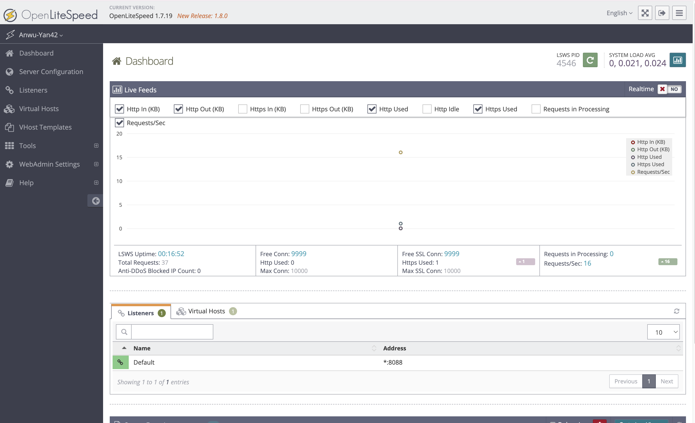


#### 159. Accessing the OpenLiteSpeed Custom panel

After setting up OpenLiteSpeed and adjusting its administrative password, you might want to preview your website or web application as it would appear to visitors or customers. This is done by accessing the OpenLiteSpeed web server using a web browser. Here's how:

**Navigating to Your Site**
- Open your web browser and type `localhost:8088` in the address bar. The port 8088 is the default port used by OpenLiteSpeed for web traffic, particularly when first setting up the server or for testing purposes.

**What You'll See**
- Web Server Response: If OpenLiteSpeed is running and configured correctly, navigating to localhost:8088 will display the default OpenLiteSpeed landing page or your own website if you have already deployed it to the server.

**Purpose and Use**
- Testing and Development: Accessing your site through localhost:8088 is primarily for testing and development. It allows developers and site administrators to view and interact with web content as an end-user would, without making the site publicly accessible on the internet.
- Local Preview: Before deploying changes live, you can preview updates, ensuring everything functions as expected in a controlled, local environment.


**Transitioning to Public Access**
- When your site is ready for public access, you would typically:
	- Change the Listening Port: Configure OpenLiteSpeed to listen on the standard HTTP and HTTPS ports (80 and 443, respectively), moving away from 8088 for public traffic.
	- Secure Your Site: Implement SSL/TLS to secure your site using HTTPS. For a live website, it's advisable to obtain a certificate from a recognized Certificate Authority (CA) like Let's Encrypt, rather than relying on a self-signed certificate which can trigger browser warnings.
	-Domain Configuration: Assign a domain name to your site, directing users to your web content without needing to specify a port number.


  Evaluating Virtualization and Operating System Details on Debian: Commands Overview
---


# Congratulations!! 🥳 WHAT AN IMPRESSIVE ACHIEVEMENT!!!!  🤘


--- 
## Part 4️⃣: Evaluating Virtualization and Operating System Details on Debian: Commands Overview


---
