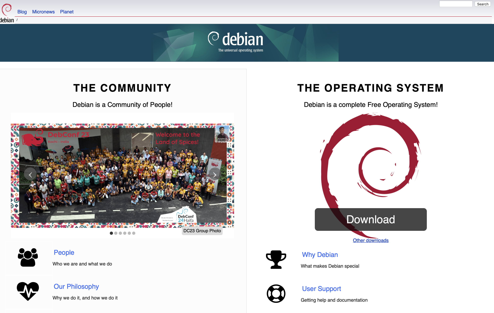
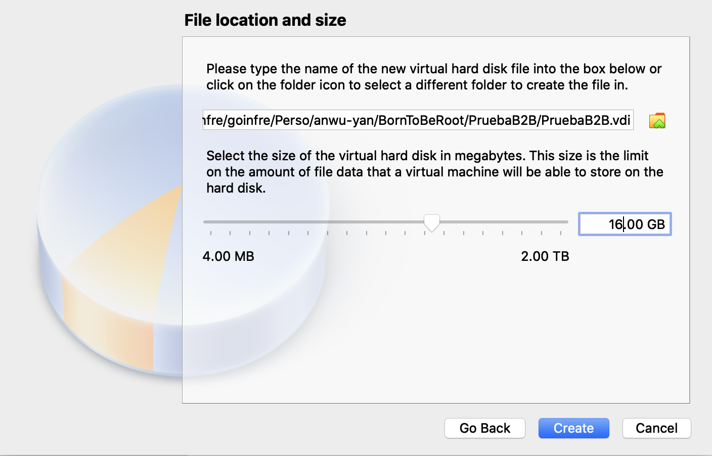

# Documentation: Creating a VirtualBox VM

## Introduction

This section provides an overview of the purpose behind documenting the VirtualBox setup process, highlighting the importance of following specific configurations for the "Born to Be Root" project.

## Requirements

## Step 1: Download and Install VirtualBox

1. **Download VirtualBox**:
   
   - Go to the [VirtualBox website](https://www.virtualbox.org/wiki/Downloads) and download the latest version for macOS.

2. **Install VirtualBox**:
   - Open the downloaded file and follow the installation instructions. You might need to allow the installation in your system preferences due to macOS security settings.

## Step 2: Download the Debian or Rocky ISO

- **Debian**: Visit the [Debian download page](https://www.debian.org/download) and download the latest stable ISO file. (I chose Debian)
- **Rocky Linux**: Go to the [Rocky Linux download page](https://rockylinux.org/download) and get the latest stable ISO.

--- 
### What´s the best option?

If you're new to Linux and looking for a _general-purpose operating system to get started with, especially for personal use or learning_, **Debian** is easier and more accessible. It has a vast community and resources to help beginners. **Rocky Linux**, on the other hand, is more tailored for _professional or enterprise server environments_ where RHEL compatibility is important.

---

## Step 3: Create a New Virtual Machine

1. **Open VirtualBox**:
   - Launch VirtualBox from your Applications folder.
2. **Create New VM**:
   - Click on "New" to start creating your virtual machine. Name your VM (e.g., "BornToBeRoot"), find the machine folder, select the type (Linux), and version (Debian (64-bit in our case) or other Linux versions depending on your ISO).

### Difference between debian 32-bit & 64-bit

Choosing between a 32-bit and a 64-bit Debian system boils down to how much memory (RAM) you want to use and the type of processor in your computer.

**- Processor Type:** If your computer has a 64-bit processor, you can choose either 32-bit or 64-bit Debian. But, if your processor is 32-bit, you must use 32-bit Debian.

**- Memory Usage:** 32-bit systems are limited to using about 4GB of RAM. If you have more than 4GB of RAM, you should use a 64-bit system to take full advantage of the extra memory.

**- Performance:** On computers that support it, 64-bit Debian can be faster and more efficient, especially if you have a lot of RAM.

**- Software Compatibility:** With a 64-bit system, you can run both 32-bit and 64-bit programs. However, on a 32-bit system, you can only run 32-bit software.

In simple terms, if your computer is relatively new and has more than 4GB of RAM, go for 64-bit Debian to make sure you're using all your hardware's capabilities. If you have an older computer or one with less RAM, 32-bit Debian might be the better choice.

3. **Allocate RAM**:
   - Assign the default memory size 1024MB (1GB in our case) or 2GB (2048 MB) if possible.

### Why 1024MB?

When setting up a virtual machine (VM), the default memory size is often set to 1024MB (1GB) for a balance of performance and resource allocation. Here’s a simplified explanation:

**- Compatibility:** 1024MB is a moderate amount of RAM that ensures the VM can run most operating systems and basic applications without requiring too much memory from the host machine.

**- Performance:** This amount is chosen as a starting point that provides acceptable performance for lightweight tasks. It's enough to run the system smoothly for basic use, but it's low enough not to strain the host system's resources unnecessarily.

**- Flexibility:** Users can adjust the memory size based on their needs. 1024MB serves as a safe default that works for many scenarios, but you can increase it if you're running more demanding applications or decrease it for simpler tasks to conserve system resources.

**- Resource Management:** Not all users will have a lot of RAM available on their host machines. Setting the default memory size to 1024MB strikes a balance between usability and accessibility, allowing more users to work with VMs without having high-end hardware.

In essence, the default memory size of 1024MB is chosen to ensure that virtual machines are accessible and perform well for a broad range of users and use cases, providing a good starting point that can be adjusted as needed.

4. **Create a Virtual Hard Disk**:
   - Choose "Create a virtual hard disk now", a dynamically allocated disk, and allocate at least 10GB of space for your Debian or Rocky installation.

**Since I choose 1GB - 1024 MB, the recommended size of the hard disk is 8.GB**

   - Choose VDI (VirtualBox Disk Image)
  

   - Choose Dynamically allocated

   
   - File location and size

### Why 16GB?

Allocating 16GB for file storage ensures you have enough space for the operating system, applications, and additional files without filling up the entire disk. This leaves room for the system to operate smoothly and for future expansion if needed.

## Step 4: Configure Your VM

**1. Select Your VM:** Click on the name of your VM in the VirtualBox main window, then click "Settings".

**2. System:** Go to the System section, and under the Motherboard tab, ensure the boot order includes the optical drive and hard disk, with the optical drive first.
Under the Processor tab, you can assign more CPUs if you wish, but 1 is enough to start.

**3. Storage:** In the Storage section, next to "Controller: IDE", click on the empty disk icon. Then, on the right side, click the disk icon next to "Optical Drive" and select "Choose a disk file...". Locate and select your downloaded Debian or Rocky ISO.

**4. Network:** Go to the Network section, and in Adapter 1, attached to NAT, ensure it's enabled. This setting will allow your VM to access the internet through your Mac.

