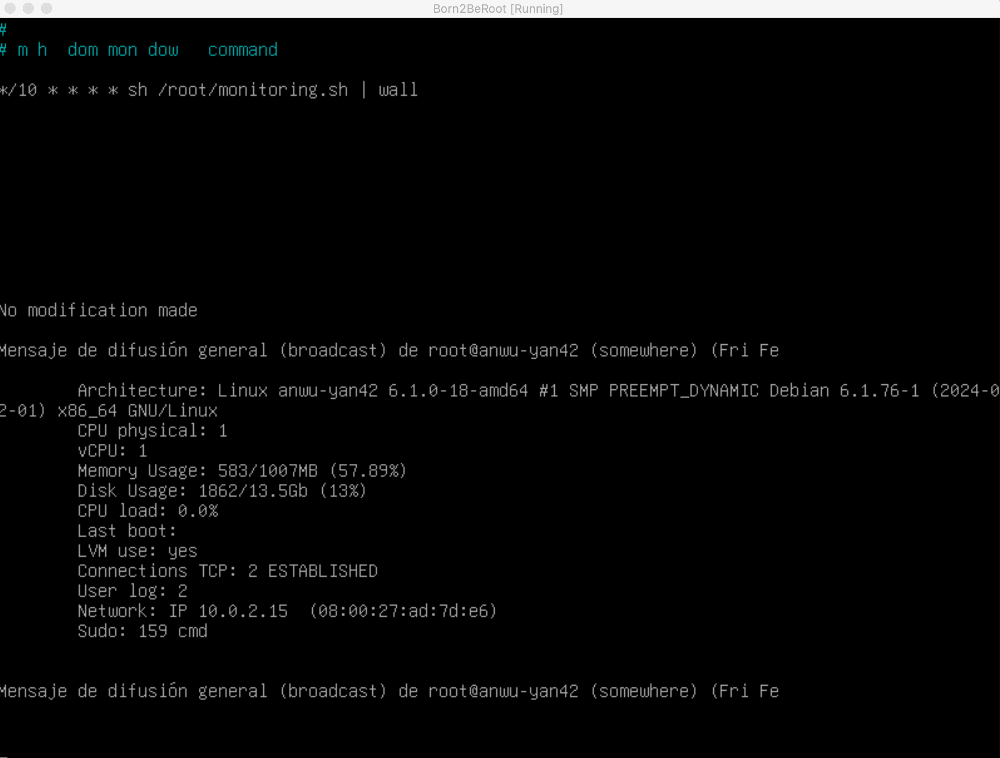
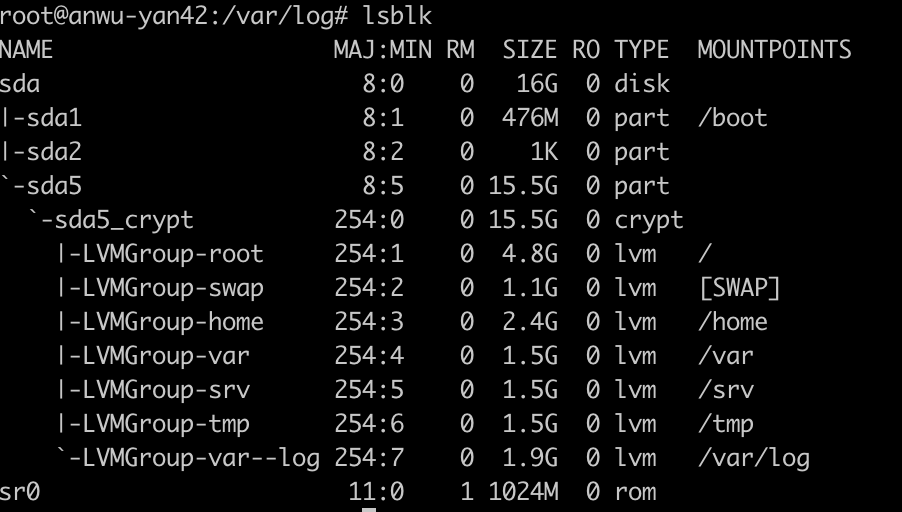
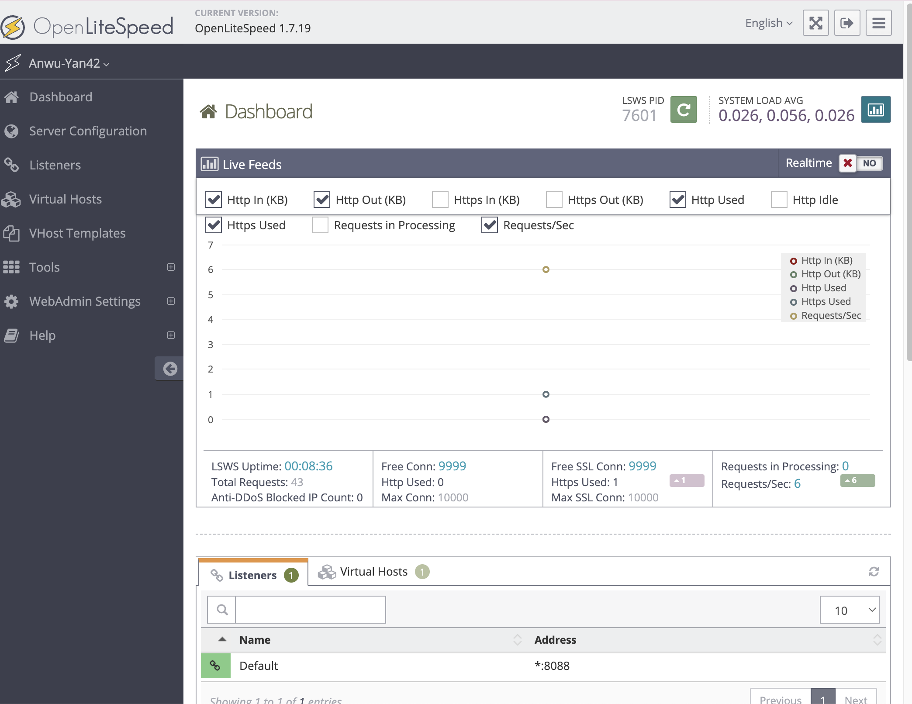
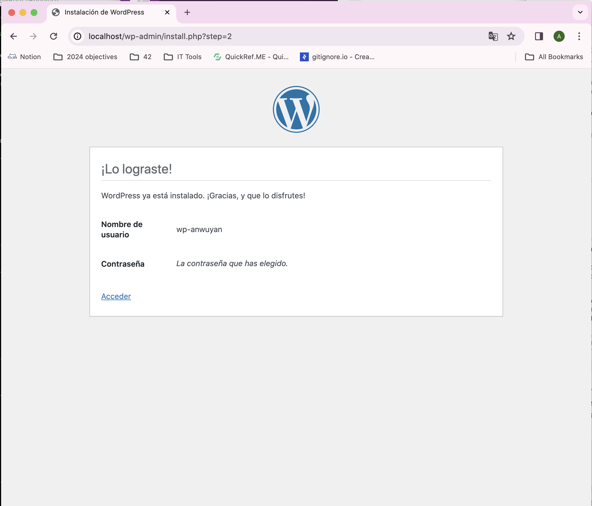

# Result

# Script monitoring (mandatory)

# SSH (mandatory)

local host 4242

# partition (bonus)

# Open lite speed monitor (bonus)

local host 7080

# Open lite speed client (bonus)

local host 8088

# Wordpress monitor(bonus)

# Wordpress client (bonus)

local host 80

